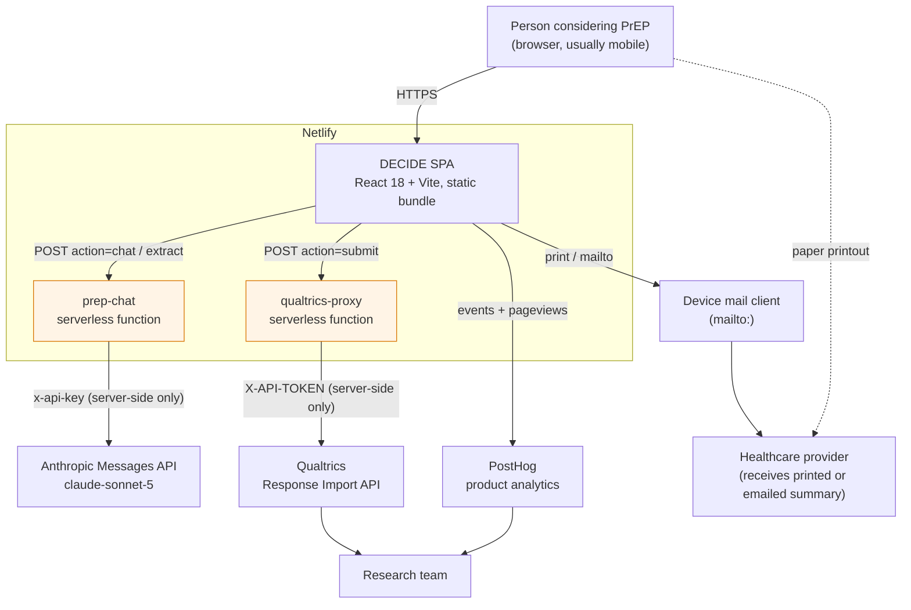
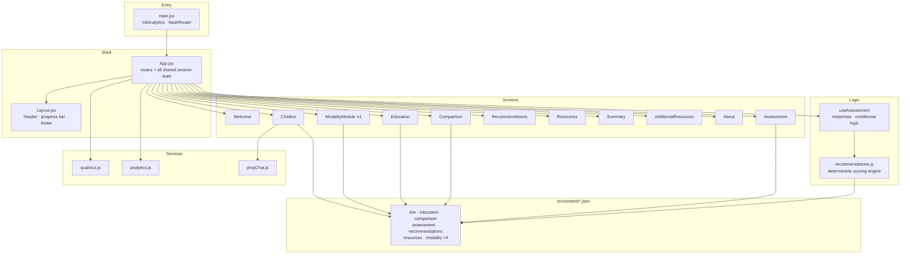
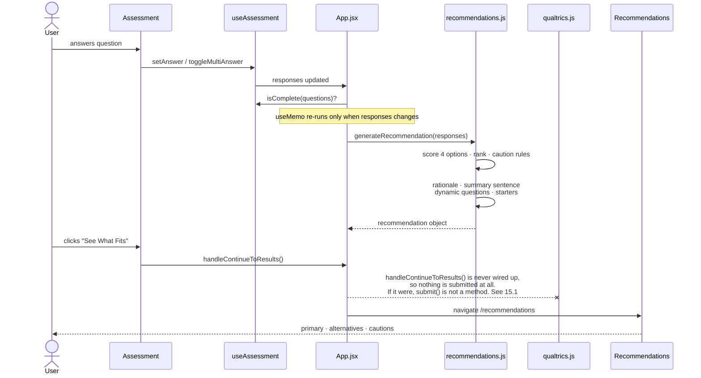
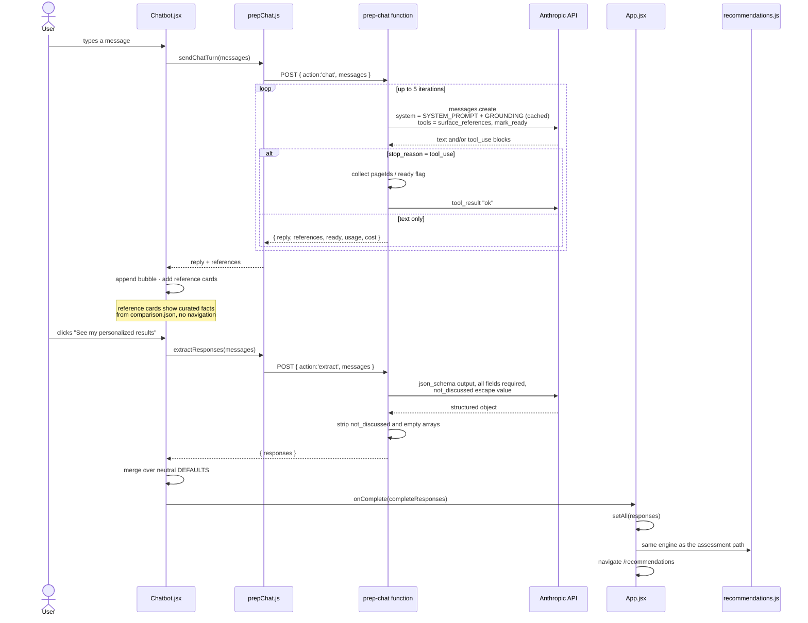
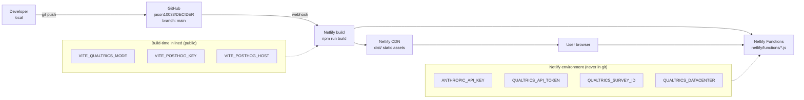
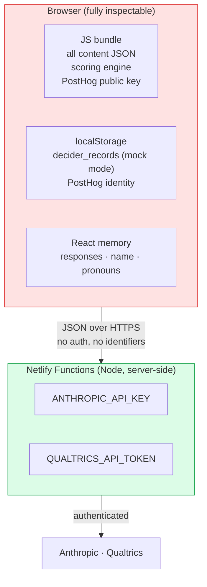

# DECIDE: PrEP Options Counseling
## Functional Specification, Technical Specification, and Systems Architecture

| | |
|---|---|
| **Document version** | 1.0 |
| **Date** | 19 August 2026 |
| **Status** | Baseline. Reflects `main` at commit `ce46322`. |
| **Repository** | https://github.com/jason10033/DECIDER (private) |
| **Package name** | `decider-prep-counseling` v1.0.0 |
| **Owner** | Jason Zucker |
| **Purpose of this document** | A complete handoff record. Someone who has never seen this codebase should be able to read this document, clone the repository, run it, change it, and deploy it without asking a question. |

### Maintenance protocol

This document is updated **weekly** and on any change to the deployed site. The update is mechanical:

1. Diff `main` against the commit named in the header above.
2. Update every section the diff touches. Sections 4, 5, 7, 8, and 11 are the ones that go stale first.
3. Add a row to the changelog in Section 14.
4. Bump the document version (minor for content changes, major for architectural changes) and the commit hash in the header.

A change that is not reflected here is a change that has not been handed over.

---

## Table of contents

**Part 0: Theoretical foundation**
- T1. Why a framework matters here
- T2. The primary framework: the Ottawa Decision Support Framework
- T3. Quality standard: IPDAS
- T4. The clinical encounter: Elwyn's three-talk model
- T5. Where DECIDE departs from orthodoxy, and why
- T6. Evidence base, evaluation plan, and references

**Part I: Functional specification**
1. Purpose and scope
2. Users and stakeholders
3. The user journey
4. Screen-by-screen functional requirements
5. Clinical and business rules
6. Non-functional requirements

**Part II: Technical specification**
7. Technology stack and repository layout
8. Application state model
9. Content model (the JSON contract)
10. The recommendation engine
11. Serverless functions and external integrations
12. Configuration and environment variables

**Part III: Systems architecture**
13. Architecture diagrams

**Part IV: Handoff**
14. Build, run, deploy
15. Known gaps, risks, and backlog
16. Changelog

---

# Part 0: Theoretical foundation

## T1. Why a framework matters here

DECIDE is a patient decision aid. That is a defined class of intervention with an established theoretical base, an international quality standard, and a Cochrane evidence base of over two hundred randomised trials. Building one without naming the framework it implements is how a tool ends up as an attractive brochure with a quiz bolted on.

Naming the framework does three concrete things for this project:

1. It tells a developer **which behaviours are load-bearing** and must survive refactoring. The congruence filter in `generateSummarySentence` looks like a stylistic nicety; it is in fact the values-clarification mechanism, and removing it would change what class of intervention this is.
2. It gives the research team **the outcome measures to evaluate against**, rather than inventing them after the fact.
3. It gives the clinical team **a defensible answer** to the two hardest questions a health department will ask: why does this tool recommend anything at all, and how do you know it does not just push people toward the newest drug.

PrEP is a textbook **preference-sensitive decision**. All four modalities are highly effective. There is no dominant option on efficacy for most people. The right choice turns on how a specific person weighs privacy against needles, convenience against reversibility, and cost against clinic burden. This is precisely the decision class for which decision aids were designed and in which they have the strongest evidence (Stacey et al., 2024).

## T2. The primary framework: the Ottawa Decision Support Framework

**DECIDE implements the Ottawa Decision Support Framework (ODSF).** The ODSF, developed by O'Connor and colleagues and updated in a three-part 20th-anniversary review (Hoefel et al., 2020; Stacey et al., 2020), is the most widely used theoretical basis for patient decision aids. It is organised into three sequential elements: **assess decisional needs → provide decision support → evaluate decision quality**.

The ODSF holds that unresolved decisional needs cause decisional conflict, that decisional conflict causes decision delay, decision regret, and blame, and that targeted decision support resolves the needs and therefore improves decision quality. Decision quality in the ODSF is defined as **informed, values-congruent choice**.

### T2.1 Element 1: decisional needs → what DECIDE assesses and addresses

| ODSF decisional need | How DECIDE addresses it | Where in the code |
|---|---|---|
| **Inadequate knowledge** | Learn page plus four modality deep dives plus the eleven-category comparison matrix | `education.json`, `modality-*.json`, `comparison.json` |
| **Unrealistic expectations** | Every option template carries a `considerations` list alongside its `reasons` list, so benefits and harms are presented symmetrically | `recommendations.json` |
| **Unclear values** | The eleven-question assessment is an explicit values-clarification exercise; `prep_09` in particular forces a single-priority trade-off | `assessment.json`, `useAssessment.js` |
| **Inadequate support and resources** | Provider-question generator, conversation-starter generator, the physician-view summary, and the external resource directory | `recommendations.js`, `Resources.jsx`, `Summary.jsx`, `resources.json` |
| **Unclear about what matters most (decisional conflict)** | The ranked result plus the congruence-filtered summary sentence names back to the user which of their own stated values drove the match | `generateSummarySentence()` |
| **Difficult decision-making role** | Framing throughout: "a decision you and your healthcare provider make together"; the tool never says a choice is correct | `assessment.json`, `Recommendations.jsx` |

Two of these deserve elaboration because they are the parts most likely to be broken by a well-meaning code change.

**Values clarification.** Witteman et al. (2021), in an updated systematic review and meta-analysis of 33 studies, found that explicit values clarification methods improve values-congruence of choice and reduce decisional conflict relative to decision aids without them. DECIDE uses an **implicit-to-explicit hybrid**: the assessment elicits attribute-level preferences (implicit), and the summary sentence reflects them back in the user's own terms (explicit). The design rule in `generateSummarySentence` is that **only factors that genuinely support the recommended option are named**. A factor pointing the other way is deliberately excluded, so the sentence never reads as if the tool overrode the person. That rule is a values-clarification design decision, not copy-editing.

**Unrealistic expectations.** Every option in `recommendations.json` carries `considerations`, and the Results screen renders them under "Things to consider" directly beneath the benefits. Removing that section to simplify the page would convert the tool from a decision aid into a promotional interface. It is a framework requirement.

### T2.2 Element 2: decision support → the three ODSF modalities

The ODSF recognises three decision support modalities: clinical counselling, patient decision tools, and decision coaching. DECIDE occupies the second and deliberately **hands off** to the first.

The handoff is the entire point of the Prepare and Summary screens. The tool does not attempt to close the decision. It produces an artefact designed to make the clinical counselling encounter better: a named top match, a set of alternatives the person actively chose to discuss, the questions they want to ask, the openers they can use, and a physician-facing view written in the third person with clinical section headings.

The **dual-view Summary** (patient view and physician view) is an unusual feature among decision aids and is worth naming as a design contribution: it produces one artefact that serves both sides of the ODSF's clinical-counselling modality without asking the user to translate their own preferences into clinical language.

### T2.3 Element 3: decision quality → what should be measured

The ODSF's outcome is **decision quality: an informed, values-congruent choice**. The validated instruments are:

| Construct | Instrument | Note |
|---|---|---|
| Decisional conflict | **Decisional Conflict Scale** (O'Connor, 1995), 16 items, five subscales: informed, values clarity, support, uncertainty, effective decision | The primary ODSF outcome measure |
| Decisional conflict, brief | **SURE test**, 4 items | Practical for a web tool where a 16-item scale would cause dropout |
| Preparedness | **Preparation for Decision Making Scale** (Bennett et al., 2010), 10 items | Measures exactly what DECIDE's Summary screen is for |
| Knowledge | Study-specific items on the four modalities | |
| Values-congruence | Concordance between stated top priority (`prep_09`) and eventual regimen | Requires follow-up |

**None of these are currently instrumented.** See Section 15 and T6.2.

## T3. Quality standard: IPDAS

The **International Patient Decision Aid Standards** (Elwyn et al., 2006; Joseph-Williams et al., 2014; IPDAS Evidence Update 2.0, 2021) is the field's quality checklist. It is not a theory; it is the conformance standard a decision aid is judged against. IPDAS separates criteria into qualifying (a tool is not a decision aid without these), certifying (a tool with serious risk of harmful bias without these), and quality criteria.

Below is an honest self-audit of DECIDE against the core IPDAS dimensions as of this baseline.

| IPDAS criterion | Status | Evidence or gap |
|---|---|---|
| **Qualifying** | | |
| Describes the health condition | Met | `/education`, three accordion sections |
| Describes the decision to be considered | Met | Welcome and Assessment intro copy |
| Lists the options | Met | All four modalities, plus the implicit option of not starting is **not** presented (see gap below) |
| Describes positive and negative features of each option | Met | `reasons` and `considerations` for all four |
| **Certifying** | | |
| Presents probabilities of outcomes in an unbiased, understandable way | **Partial** | Effectiveness is described in prose ("96% reduction in HIV risk in clinical trials" for lenacapavir; "even more effective than daily pills" for cabotegravir). There are no event rates, no common denominator, and no visual risk display. This is the single largest IPDAS gap. |
| Includes methods to clarify and express values | Met | The 11-question assessment and the congruence-filtered summary |
| Includes structured guidance for deliberation and communication | Met | Prepare screen and dual-view Summary |
| **Quality** | | |
| Uses plain language | Met | Reading level is consistently low; no formal Flesch-Kincaid audit has been run |
| Balanced presentation of options | **Partial** | Presentation is balanced; the *ranking* is not neutral by design. See T5.1. |
| Discloses funding source and conflicts of interest | **Not met** | The About page describes the tool but does not disclose funding or COI. This is a qualifying-adjacent expectation and a straightforward fix. |
| Provides evidence sources and update policy | **Not met** | No citations, no "last reviewed" date, no named clinical reviewer anywhere in the interface. |
| Reports development process | **Not met** | Not described in the tool |
| Includes the option of doing nothing | **Not met** | "Not starting PrEP" is not presented as an option |
| Field-tested with users and clinicians | Unknown | Not documented in the repository |

**The four "not met" rows are the highest-value non-code work available on this project.** Three of them (funding disclosure, evidence sources with a review date and named reviewer, development process) are content additions to `About.jsx` and require no engineering. The fourth (presenting the option of not starting) is a genuine design question for the clinical team: a prevention tool that offers "no PrEP" as an equal option is making a different clinical statement than one that does not, and the decision should be deliberate rather than accidental.

## T4. The clinical encounter: Elwyn's three-talk model

The ODSF explains what the *tool* must do. Elwyn's **three-talk model** (Elwyn et al., BMJ 2017) explains what the *encounter* must do, and DECIDE is explicitly designed to pre-load two of its three stages.

| Three-talk stage | What it requires | What DECIDE contributes |
|---|---|---|
| **Team talk** | Establish that a choice exists and that the patient's preferences matter | The conversation starters, especially "I used a decision tool that helped me think about my PrEP options. Can I share what I learned with you?" This is a scripted team-talk opener. |
| **Option talk** | Compare the alternatives and their trade-offs | Done before the visit. The comparison matrix, the deep dives, and the selected-alternatives list mean the clinician does not have to deliver Option Talk cold in a fifteen-minute slot. |
| **Decision talk** | Elicit preferences and arrive at a decision together | Deliberately left to the clinician. DECIDE supplies the inputs (top match, rationale, chosen alternatives, questions) and stops. |

This mapping is why the tool's output is an artefact rather than a verdict, and why the physician view is written in the third person with the patient's chosen pronouns: it is designed to be *handed over* at the start of Decision Talk.

The generated provider questions serve a second, evidence-supported function. Patients frequently do not raise their concerns; a pre-written question list is a low-cost intervention against that, and it is why the Prepare screen makes the user *actively select* questions rather than printing all of them. Selection is a commitment device.

## T5. Where DECIDE departs from orthodoxy, and why

Three design choices sit outside the mainstream decision-aid pattern. Each is defensible, and each should be defended explicitly rather than discovered by a reviewer.

### T5.1 It ranks the options

Most IPDAS-conformant decision aids present options neutrally and refuse to recommend. DECIDE scores and ranks. The justification:

- The ranking is **transparent and deterministic**. Every weight is in one readable function; the full table is in Section 10.2 of this document. It is not a black box and not a model.
- The ranking is **explained in the user's own terms**. `summarySentence` and `rationale[]` name the specific answers that produced the result. The user can see, and disagree with, the reasoning.
- The result is **framed as a starting point, never as a decision**. Every screen repeats this.
- Alternatives remain **fully visible and actively selectable** for the summary, so the ranking narrows attention without foreclosing options.

The residual risk is real: a ranked result can anchor a user who would otherwise have deliberated. The honest framing is that DECIDE is a **decision aid with a preference-matching layer**, and the preference-matching layer should be evaluated on whether it improves or degrades values-congruence relative to the same content presented unranked. That is a testable question and it has not been tested.

### T5.2 Some options are actively cautioned

The three hard exclusion rules in Section 5.1 (on-demand for people assigned female at birth or of uncertain natal sex; on-demand and both injectables in pregnancy or pregnancy planning) are not preference weighting. They are clinical eligibility, imported from labelling and guideline evidence.

The framework justification is that the ODSF's decision-quality target is an **informed** choice, and a person who chooses an option their clinician will immediately rule out has not made an informed one. The design decision that keeps this IPDAS-compatible is that cautioned options are **still displayed**, in a clearly labelled "Less Suitable for Your Situation" block, with the reason stated in plain language and a pointer to the provider. Hiding them would be paternalistic; showing them with the reason is informative.

### T5.3 The chatbot pilot

The conversational entry point has no established decision-aid framework behind it. It is a genuine research question rather than a settled design, and it should be described as such.

What keeps it inside the framework:

- It **grounds the model in the tool's own curated facts.** The `GROUNDING` block is generated from `comparison.json`, and the system prompt forbids contradicting it. The chatbot cannot say something the Compare page does not say.
- It **does not make the recommendation.** The model's only job is conversation and structured extraction into `prep_00`..`prep_10`. The same deterministic engine then runs. Decision quality is therefore bounded by the same auditable logic on both paths.
- It **covers the same eleven dimensions**, enumerated in the system prompt, so the values-clarification content is preserved.
- The extraction schema's `not_discussed` escape value and the neutral client-side defaults exist so that a partial conversation degrades to a *less-informed* recommendation rather than a *wrongly-informed* one.

What is untested: whether a conversational elicitation produces the same values-clarification benefit as an explicit structured exercise, or whether it produces a fluent, agreeable, and less reflective process. Witteman's finding that *explicit* values clarification outperforms implicit is a reason for genuine caution here. If the pilot is evaluated, this is the comparison worth running: assessment path versus chatbot path, on the SURE test and on values-congruence.

## T6. Evidence base, evaluation plan, and references

### T6.1 The evidence this tool is standing on

The Cochrane review of patient decision aids (Stacey et al., 2024) covers **209 randomised trials, 107,698 participants, 71 decisions**. Compared with usual care, decision aids:

- improve knowledge (mean difference **11.90/100**, high-certainty evidence, 107 studies, 25,492 participants)
- improve accuracy of risk perception (RR **1.94**, high-certainty, 25 studies, 7,796 participants)
- reduce feeling uninformed (MD **-10.02**) and indecision about personal values (MD **-7.86**)
- probably increase congruence between informed values and care choice (RR **1.75**, moderate-certainty, 21 studies, 9,377 participants)
- reduce passive decision-making (RR **0.72**)
- produce **no difference in decision regret**

This is the strongest argument for the tool's existence, and the specific numbers are worth having to hand for a funder conversation. The caveat that must accompany them: those effects are for decision aids as a class, evaluated in trials. **They are not evidence about DECIDE**, which has not been evaluated.

The domain-specific literature is thinner and newer. Shared decision-making tools for PrEP regimen choice are an active area with published development and acceptability work, and the general finding is that people making PrEP decisions weigh adherence burden, privacy, and clinic access at least as heavily as efficacy, which is exactly the attribute set DECIDE elicits.

### T6.2 A proportionate evaluation plan

Nothing here requires a trial. This is what would generate defensible evidence at pilot scale:

| Stage | Method | Instrument | Effort |
|---|---|---|---|
| 1. Content validity | Clinical review of all ten content JSON files against current CDC and NYSDOH guidance; record reviewer name and date in the About page | IPDAS evidence-source criteria | Days |
| 2. Alpha testing | Cognitive interviews with 5-8 people considering PrEP and 3-5 providers | IPDAS field-testing criteria | Weeks |
| 3. Decisional conflict | Add a 4-item SURE test at the end of the Summary screen, submitted with the assessment | SURE | One sprint, once Section 15.1 is fixed |
| 4. Preparedness | Add the 10-item Preparation for Decision Making Scale | PDMS | One sprint |
| 5. Path comparison | Randomise or naturally compare assessment path against chatbot path on SURE and knowledge | | Pilot |
| 6. Values-congruence | Follow-up on whether the regimen actually started matches the stated top priority | | Requires linkage; hardest |

Stages 1 and 2 close four of the five IPDAS gaps in T3 and require no engineering. Stage 3 is the first that produces a number, and it is blocked on the Qualtrics defect in Section 15.1: **there is currently no working path by which any outcome measure could be recorded.** That reframes 15.1 from a bug to the critical path for the entire evaluation.

### T6.3 References

Bennett C, Graham ID, Kristjansson E, Kearing SA, Clay KF, O'Connor AM. Validation of a preparation for decision making scale. *Patient Education and Counseling* 2010;78(1):130-133.

Elwyn G, O'Connor A, Stacey D, et al. Developing a quality criteria framework for patient decision aids: online international Delphi consensus process. *BMJ* 2006;333:417.

Elwyn G, Durand MA, Song J, et al. A three-talk model for shared decision making: multistage consultation process. *BMJ* 2017;359:j4891. https://pubmed.ncbi.nlm.nih.gov/29109079/

Hoefel L, O'Connor AM, Lewis KB, et al. 20th Anniversary Update of the Ottawa Decision Support Framework Part 1: a systematic review of the decisional needs of people making health or social decisions. *Medical Decision Making* 2020;40(5):555-581.

Hoefel L, Lewis KB, O'Connor A, Stacey D. 20th Anniversary Update of the Ottawa Decision Support Framework Part 2: subanalysis of a systematic review of patient decision aids. *Medical Decision Making* 2020;40(4):522-539.

Joseph-Williams N, Newcombe R, Politi M, et al. Toward minimum standards for certifying patient decision aids: a modified Delphi consensus process. *Medical Decision Making* 2014;34(6):699-710.

O'Connor AM. Validation of a decisional conflict scale. *Medical Decision Making* 1995;15(1):25-30.

Ottawa Hospital Research Institute. Ottawa Decision Support Framework. https://decisionaid.ohri.ca/odsf.html

Stacey D, Légaré F, Boland L, et al. 20th Anniversary Ottawa Decision Support Framework Part 3: overview of systematic reviews and updated framework. *Medical Decision Making* 2020;40(3):379-398. https://pubmed.ncbi.nlm.nih.gov/32428429/

Stacey D, Lewis KB, Smith M, et al. Decision aids for people facing health treatment or screening decisions. *Cochrane Database of Systematic Reviews* 2024, Issue 1. CD001431.pub6. https://www.cochranelibrary.com/cdsr/doi/10.1002/14651858.CD001431.pub6/full

Witteman HO, Ndjaboue R, Vaisson G, et al. Clarifying values: an updated and expanded systematic review and meta-analysis. *Medical Decision Making* 2021;41(7):801-820. https://pubmed.ncbi.nlm.nih.gov/34565196/

NYSDOH AIDS Institute Clinical Guidelines Program. PrEP to prevent HIV and promote sexual health. https://www.hivguidelines.org/guideline/hiv-prep/

---

# Part I: Functional specification

## 1. Purpose and scope

### 1.1 What DECIDE is

DECIDE is a patient-facing shared decision-making aid for HIV pre-exposure prophylaxis. It walks a person through four PrEP modalities, elicits their preferences, produces a ranked recommendation with a plain-language rationale, and generates a printable or emailable summary the person brings to a clinical visit.

The tool explicitly does **not** prescribe, diagnose, or replace clinical judgement. Every output is framed as a starting point for a conversation with a provider.

### 1.2 The four modalities covered

| Internal id | Display name | Drug | Brand | Cadence |
|---|---|---|---|---|
| `oral` | Daily Pill | tenofovir/emtricitabine | Truvada / Descovy | Daily |
| `on_demand` | On-Demand Pill | tenofovir disoproxil fumarate/emtricitabine, 2-1-1 schedule | Truvada | Event-driven |
| `injectable_2mo` | 2-Month Injection | cabotegravir | Apretude | Every 8 weeks |
| `injectable_6mo` | 6-Month Injection | lenacapavir | Yeztugo | Every 6 months |

These four ids appear throughout the codebase as object keys, CSS class stems, and content filenames. Adding a fifth modality means touching every one of the places listed in Section 15.4.

### 1.3 In scope

- Education about PrEP and each modality
- Side-by-side and head-to-head comparison
- An 11-question preference assessment
- A deterministic, rule-based recommendation engine
- Provider-conversation preparation (questions, conversation starters)
- A dual-audience printable summary (patient view and physician view)
- Email handoff of the summary via the device mail client
- An optional conversational front door (the "Chatbot pilot") that reaches the same recommendation engine through a Claude-mediated conversation
- Anonymous product analytics
- Optional anonymous submission of assessment responses to Qualtrics for research

### 1.4 Explicitly out of scope

- Any form of user account, login, or identity
- Server-side persistence of an individual's answers
- Prescribing, ordering, e-prescribing, or EHR integration
- Clinical decision support intended for a clinician user
- Any handling of protected health information as a covered entity

### 1.5 Privacy stance

The tool states to the user: *"This tool does not collect or store any personal health information. Your answers are used only during this session to generate your personalized results and are not saved or shared."*

This is accurate as deployed **with one nuance that must be preserved by anyone changing the code**: assessment responses are POSTed to Qualtrics when `VITE_QUALTRICS_MODE=live`, and chatbot transcripts are POSTed to the Anthropic API. Neither carries a name, an identifier, or contact information. The name and pronoun fields on the Summary screen are held in browser memory only and are never transmitted anywhere except into a `mailto:` body that the user themselves sends. Any change that begins persisting identified data invalidates the on-screen privacy claim and must be accompanied by a change to `src/content/site.json`.

---

## 2. Users and stakeholders

| Actor | Role | Interaction |
|---|---|---|
| **Person considering PrEP** | Primary user | Completes the full flow in a browser, unauthenticated, typically on a phone |
| **Healthcare provider** | Secondary reader | Receives the physician-view summary on paper or by email; never uses the tool directly |
| **Research team** | Data consumer | Reads aggregate assessment responses in Qualtrics and product analytics in PostHog |
| **Content owner (clinical)** | Editor | Owns the accuracy of every clinical statement in `src/content/*.json` |
| **Developer** | Maintainer | Owns code, deploy, and secrets |

There are no roles inside the application. There is no administrative interface. Content changes are code changes.

---

## 3. The user journey

The application presents a seven-step progress bar (defined in `site.json.modules`) across the top of every screen except the welcome page and the modality deep-dive pages.

```
Welcome  ->  Learn  ->  Compare  ->  Assess  ->  Results  ->  Prepare  ->  Summary  ->  Resources
   /        /education   /compare  /assessment /recommendations /resources /summary  /additional-resources
```

There is a parallel entry point:

```
Welcome  ->  Chatbot  ->  (conversation)  ->  Results  ->  Prepare  ->  Summary
   /        /chatbot                        /recommendations
```

The chatbot path bypasses Learn, Compare, and Assess. It produces the same `responses` object the assessment produces, and from `/recommendations` onward the two paths are identical.

### 3.1 Navigation rules

- Routing is **hash-based** (`HashRouter`). Every URL is of the form `https://host/#/route`. This is deliberate: it makes the app deployable as pure static files behind any host without server-side rewrite rules, and it makes the "open in new tab" links from the chatbot side panel work reliably.
- Navigation is entirely forward and backward by explicit buttons. There is no wizard enforcement: a user may deep-link to any route.
- Deep-linking to `/recommendations` or `/summary` without a completed assessment shows a graceful empty state directing the user back to `/assessment`, not an error.
- `Layout` scrolls the window to the top on every route change.

---

## 4. Screen-by-screen functional requirements

### 4.1 Welcome (`/`)

**Component:** `src/components/Welcome.jsx` · **Content:** `src/content/site.json` → `welcome`

| Requirement | Detail |
|---|---|
| F-W-01 | Displays badge, heading, subheading, and description from `site.json.welcome` |
| F-W-02 | Renders a "How It Works" grid of four numbered step cards from `welcome.steps` |
| F-W-03 | Each step card is clickable and keyboard-activatable (Enter) and navigates to `step.route` |
| F-W-04 | A primary CTA button navigates to `/education` |
| F-W-05 | Displays the privacy disclaimer from `welcome.disclaimer` |
| F-W-06 | The progress bar is hidden on this route |

### 4.2 Learn (`/education`)

**Component:** `src/components/Education.jsx` · **Content:** `src/content/education.json`

| Requirement | Detail |
|---|---|
| F-E-01 | Renders three collapsible accordion sections: `what_is_prep`, `who_benefits`, `how_prep_works`. All start closed. |
| F-E-02 | Each section renders `content` prose plus an optional `keyPoints` bullet list |
| F-E-03 | Section icons map through a fixed table (`shield`, `heart`, `lock`) to emoji glyphs |
| F-E-04 | Renders four modality cards from `education.json.modalityCards`, each with icon, title, tagline, and a "Learn More" link to `card.route` |
| F-E-05 | Each modality card carries a visited badge, driven by the session-level `visitedModalities` array in `App.jsx`. The badge reads "Visited" with a check once the user has opened that modality page, "Not visited" otherwise. |
| F-E-06 | Back link to `/`, forward link to `/compare` |

**Note on F-E-05:** the visited state is passed *into* `Education` but is set by `ModalityModule` on mount. It is session-only and resets on reload.

### 4.3 Modality deep dive (`/learn/oral-prep`, `/learn/on-demand`, `/learn/injectable-2mo`, `/learn/injectable-6mo`)

**Component:** `src/components/ModalityModule.jsx` (one component, four routes, four content files)

| Requirement | Detail |
|---|---|
| F-M-01 | Content is passed as a prop. The four content files are `modality-oral.json`, `modality-on-demand.json`, `modality-injectable-2mo.json`, `modality-injectable-6mo.json` |
| F-M-02 | On mount, calls `onVisitModality(content.id)`, which records the visit in `App.jsx` state |
| F-M-03 | On mount, opens the first section by default; all others closed |
| F-M-04 | Renders a colour-coded banner using `content.colorClass` |
| F-M-05 | Renders a "Key Takeaways" block from `content.keyTakeaways` if present |
| F-M-06 | Renders accordion sections. Each may carry `content`, `keyPoints[]`, and `callouts[]`. A callout has an optional `title`, a `text`, and a `type` that maps to a CSS class (defaults to `note`). |
| F-M-07 | Renders an FAQ accordion from `content.faqs[]` if present. **As of this baseline, none of the four content files populate `faqs`; the FAQ block therefore never renders.** Question-and-answer content lives inside a `common_questions` section instead. |
| F-M-08 | Back link to `/education`, forward link to `/compare` |
| F-M-09 | Progress bar is hidden on all `/learn/*` routes |

**Sections are per-file, not a fixed set.** Seven appear in all four (`overview`, `how_it_works`, `dosing_schedule`, `effectiveness`, `side_effects`, `getting_started`, `cost_access`, `common_questions` — eight, in fact); the rest vary by modality.

| File | Sections, in order |
|---|---|
| `modality-oral.json` | overview, how_it_works, **medications_available**, dosing_schedule, effectiveness, side_effects, getting_started, stopping, cost_access, common_questions |
| `modality-on-demand.json` | overview, how_it_works, dosing_schedule, effectiveness, **who_is_it_for**, side_effects, getting_started, cost_access, common_questions *(no `stopping`)* |
| `modality-injectable-2mo.json` | overview, how_it_works, dosing_schedule, effectiveness, side_effects, getting_started, **appointment_windows**, stopping, cost_access, common_questions |
| `modality-injectable-6mo.json` | overview, how_it_works, dosing_schedule, effectiveness, side_effects, getting_started, **appointment_windows**, stopping, **drug_interactions**, cost_access, common_questions |

The renderer is generic and drives entirely off the array, so a new section id needs no code change.

### 4.4 Compare (`/compare`)

**Component:** `src/components/Comparison.jsx` · **Content:** `src/content/comparison.json`

Two views, toggled in component state.

**Overview view (default)**

| Requirement | Detail |
|---|---|
| F-C-01 | Renders a matrix: eleven category rows by four modality columns |
| F-C-02 | Categories, in order: How You Take It, How Often, Where, Effectiveness, Common Side Effects, Getting Started, Stopping, Privacy, Clinic Visits, Who It's For, Drug Interactions |
| F-C-03 | Renders a "best for" block per modality from `comparison.bestFor[]` |
| F-C-04 | Offers a switch to the head-to-head view |

**Head-to-head view**

| Requirement | Detail |
|---|---|
| F-C-05 | Two dropdowns select any two of the four modalities. Defaults to the first two (`oral` and `on_demand`). |
| F-C-06 | Renders the same eleven categories for only the two selected modalities |
| F-C-07 | A back control returns to the overview view |

`comparison.json` is the single source of truth for the curated clinical facts. It is also consumed by the chatbot backend (Section 11.1) and by the chatbot's side panel (Section 4.10), so an edit here propagates to three surfaces.

### 4.5 Assess (`/assessment`)

**Component:** `src/components/Assessment.jsx` · **Content:** `src/content/assessment.json` · **State:** `src/hooks/useAssessment.js`

| Requirement | Detail |
|---|---|
| F-A-01 | Renders all visible questions on a single scrolling page, not one at a time |
| F-A-02 | Questions are grouped (`demographics`, `motivation`, `behavioral`) and a visual divider is inserted at each group boundary |
| F-A-03 | Each question shows "Question *n* of *N*" where *N* is the count of currently visible questions, so the count changes when conditional logic changes visibility |
| F-A-04 | `single_choice` questions render as radio buttons; `multi_choice` as checkboxes |
| F-A-05 | **Conditional visibility:** `prep_06` (pregnancy) is shown only when `prep_00 === 'female'`. This is the only conditional rule and it is hard-coded in two places (`Assessment.jsx` and `useAssessment.js`). |
| F-A-06 | **Exclusive options:** in a multi-choice question, selecting `none` or `prefer_not` clears all other selections; selecting anything else clears `none`/`prefer_not` |
| F-A-07 | The forward button is visually disabled (50% opacity, `not-allowed` cursor) and its click is prevented until every visible question is answered |
| F-A-08 | **Intended behaviour:** on successful forward navigation, the responses are submitted to Qualtrics, with failures caught and logged so they never block the user. **This does not happen.** See the defect note. |

> **Defect note (F-A-08). There are two independent faults here and together they mean no assessment response has ever been recorded.**
>
> 1. `App.jsx` defines `handleContinueToResults()` (lines 113-123), which is the function that would submit to Qualtrics, but **it is never passed to any component and is never called.** `Assessment` receives only `content`, `responses`, `onAnswer`, `onToggleMulti`, `nextPath`, and `backPath` (`App.jsx:182-190`), and navigates forward with a plain `<Link to={nextPath}>` (`Assessment.jsx:86-95`). On the assessment path, **no submission is even attempted.**
> 2. The function itself would not work if it were wired up. It calls `qualtricsService.submit(...)`, but both the mock and the live service export `submitAssessment`, not `submit`. That `TypeError` is what the surrounding `try/catch` swallows. This is the live fault on the chatbot path, where `handleChatComplete` (`App.jsx:105`) does run.
>
> Fixing this requires both: pass `handleContinueToResults` into `Assessment` and call it on forward navigation, **and** rename the two call sites to `submitAssessment`. See Section 15.1.

**The eleven questions**

| Id | Group | Type | Question | Option values |
|---|---|---|---|---|
| `prep_00` | demographics | single | Sex assigned at birth | `male`, `female`, `intersex`, `prefer_not_say` |
| `prep_01` | demographics | single | Prior PrEP use | `yes_oral`, `yes_injectable`, `yes_both`, `no`, `not_sure` |
| `prep_06` | demographics | single | Pregnant, breastfeeding, or planning pregnancy within a year *(conditional)* | `yes`, `no`, `not_applicable`, `not_sure` |
| `prep_07` | demographics | single | Other medications or supplements | `yes_prescription`, `yes_supplements`, `yes_both`, `no`, `not_sure` |
| `prep_10` | demographics | single | Insurance situation | `private_insurance`, `medicaid`, `medicare`, `no_insurance`, `not_sure`, `prefer_not_say` |
| `prep_02` | motivation | single | Pill or injection preference | `daily_pill`, `injection`, `no_preference` |
| `prep_05` | motivation | single | Importance of privacy | `very_important`, `somewhat`, `not_concerned` |
| `prep_08` | motivation | **multi** | Concerns about PrEP | `side_effects`, `cost`, `remembering`, `privacy`, `needles`, `clinic_visits`, `stopping`, `none` |
| `prep_09` | motivation | single | Single most important factor | `convenience`, `fewest_side_effects`, `most_effective`, `most_private`, `easiest_to_stop`, `fewest_visits`, `lowest_cost` |
| `prep_03` | behavioral | single | Feelings about needles | `fine`, `tolerable`, `prefer_avoid`, `no_way` |
| `prep_04` | behavioral | single | Acceptable clinic visit frequency | `every_2mo`, `every_3mo`, `every_6mo`, `flexible` |

The question ids are **non-sequential in display order** (00, 01, 06, 07, 10, 02, 05, 08, 09, 03, 04). Display order is the array order in `assessment.json`; the ids are historical. Do not assume id order equals display order anywhere.

### 4.6 Results (`/recommendations`)

**Component:** `src/components/Recommendations.jsx`

| Requirement | Detail |
|---|---|
| F-R-01 | If no recommendation exists (assessment incomplete), renders an empty state with a link to `/assessment` |
| F-R-02 | Renders a one-sentence plain-language summary explaining which factors drove the match |
| F-R-03 | Renders the primary recommendation card: name, heading, personalized rationale bullets, key benefits, things to consider, and an optional special note |
| F-R-04 | Renders "Other Options to Explore": the non-cautioned alternatives, each with a checkbox reading "Include in my summary". Checked alternatives flow to the Summary screen. |
| F-R-05 | Renders "Less Suitable for Your Situation": alternatives carrying a hard clinical caution. These are shown for transparency, display the caution reason, and are **not** selectable for the summary. |
| F-R-06 | Back to `/assessment`, forward to `/resources` |

### 4.7 Prepare (`/resources`)

**Component:** `src/components/Resources.jsx`

| Requirement | Detail |
|---|---|
| F-P-01 | Renders the dynamically generated list of provider questions, each with a checkbox |
| F-P-02 | Provides a free-text input to add custom questions. Enter or the Add button commits. Added questions render as removable tags. |
| F-P-03 | Renders the dynamically generated list of conversation starters, each with a checkbox |
| F-P-04 | All selections are held by index in `App.jsx` state (`selectedQuestionIds`, `selectedStarterIds`) and by value for custom questions |
| F-P-05 | Back to `/recommendations`, forward to `/summary` |

> **Fragility note (F-P-04):** selections are stored as **array indices into the generated question list**, not as the question text. If a user navigates back to `/assessment`, changes an answer, and returns, the generated list may be a different length and the previously checked indices will now point at different questions. See Section 15.2.

### 4.8 Summary (`/summary`)

**Component:** `src/components/Summary.jsx` (the largest component in the codebase)

The screen has two mutually exclusive view modes, toggled by a pair of buttons.

**Patient view (default)**

| Requirement | Detail |
|---|---|
| F-S-01 | Title "Your PrEP Conversation Guide", first person throughout ("I'm Interested In", "Questions I Want to Ask", "My Next Steps", "About Me") |
| F-S-02 | Sections: summary sentence, primary recommendation, selected alternatives, selected questions plus custom questions, selected conversation starters, next steps, and the user's own answers grouped into My Preferences / My Situation / My Concerns |
| F-S-03 | An email control opens a form for an address and then opens the device mail client via `mailto:` with a plain-text body |

**Physician view**

| Requirement | Detail |
|---|---|
| F-S-04 | Exposes optional First Name and Pronouns fields (he/him, she/her, they/them, ze/zir). Both are session-only and never transmitted. |
| F-S-05 | Title becomes "Physician's Guide for *[Name]*". Prose is rewritten to the third person by regex substitution on the summary sentence, using the selected pronoun forms. |
| F-S-06 | Group headings change to clinical labels: Preferences, Clinical Context, Concerns |
| F-S-07 | "Recommended Next Steps" is a fixed clinical checklist: discuss options against preferences and clinical factors; order baseline labs (HIV test, STI screening, renal function); collaboratively select the regimen |
| F-S-08 | A separate email control produces the physician-formatted plain-text body |

**Both views**

| Requirement | Detail |
|---|---|
| F-S-09 | A Print control calls `window.print()`. Controls carry the `no-print` class so they are excluded from the printed page. |
| F-S-10 | Answer values are rendered as human-readable option labels by looking the value up in `assessment.json`, never as raw codes |

### 4.9 Additional Resources (`/additional-resources`)

**Component:** `src/components/AdditionalResources.jsx` · **Content:** `src/content/resources.json`

| Requirement | Detail |
|---|---|
| F-AR-01 | Renders three categories in a fixed display order that deliberately differs from the file order: `find_provider`, `learn_more`, `paying` |
| F-AR-02 | Each resource renders name, description, and either an external link (new tab, `rel="noopener noreferrer"`) or a `tel:` link |

### 4.10 Chatbot pilot (`/chatbot`)

**Component:** `src/components/Chatbot.jsx` · **Client:** `src/services/prepChat.js` · **Backend:** `netlify/functions/prep-chat.js`

This is a two-column layout: a conversation on the left, a reference panel on the right.

| Requirement | Detail |
|---|---|
| F-CB-01 | Opens with a fixed greeting that states nothing is saved |
| F-CB-02 | The user types free text. Enter sends; Shift+Enter inserts a newline. |
| F-CB-03 | Each turn POSTs the full message history to the backend and appends the reply. A typing indicator shows while in flight. |
| F-CB-04 | When the model calls the `surface_references` tool, the named pages are appended to the right-hand panel. Panel entries are de-duplicated and ordered by first mention. |
| F-CB-05 | Each panel card shows a title and blurb, an expandable "Show key facts" block drawn from `comparison.json` (categories: How You Take It, How Often, Effectiveness, Who It's For, Stopping), and an "Open full page (new tab)" link built as an absolute URL so the conversation is never lost |
| F-CB-06 | When the model calls the `mark_ready` tool, a "See my personalized results" button appears. The conversation may continue afterward. |
| F-CB-07 | Pressing that button POSTs the transcript with `action: 'extract'`, receives a `prep_00`..`prep_10` object, merges it over a neutral default set, and hands it to `App.handleChatComplete` |
| F-CB-08 | `handleChatComplete` sets the shared `responses` object, fires a `chatbot_completed` analytics event, attempts a Qualtrics submission, and navigates to `/recommendations` |
| F-CB-09 | Backend errors surface as an inline error message; the conversation is not lost |
| F-CB-10 | In `vite dev` with no functions runtime, `prepChat.js` falls back to a scripted mock so the UI can be exercised without an API key. The mock is gated on `import.meta.env.DEV` and never runs in production. |

**Neutral defaults applied to a partial conversation** (from `Chatbot.jsx`):

```
prep_00: 'prefer_not_say'   prep_01: 'not_sure'        prep_02: 'no_preference'
prep_03: 'tolerable'        prep_04: 'flexible'        prep_05: 'somewhat'
prep_07: 'not_sure'         prep_08: ['none']          prep_09: 'fewest_side_effects'
prep_10: 'not_sure'
```

`prep_09` defaults to `fewest_side_effects` specifically because that value contributes zero points to every option in the scoring engine, so an unknown priority does not bias the result. If a new priority value is ever added, check that this default remains engine-neutral. If `prep_00` resolves to `female` and no `prep_06` was extracted, `prep_06` is set to `not_sure`, which triggers the pregnancy safety rules.

### 4.11 About (`/about`)

Static prose describing what the tool is, which options it covers, how it works, who built it, and its limitations.

---

## 5. Clinical and business rules

These are the rules that carry clinical weight. They are implemented in `src/services/recommendations.js` and must not be changed without clinical sign-off.

### 5.1 Hard exclusion rules (produce a "Less Suitable" caution)

| Rule | Condition | Effect |
|---|---|---|
| CR-1 | `prep_00 === 'female'` | On-demand (2-1-1) is cautioned. Reason: studied and recommended only for cisgender men who have sex with men. Scored `-10`, which is effectively disqualifying. |
| CR-2 | `prep_00` is `intersex` or `prefer_not_say` | On-demand is cautioned with a softer reason directing the user to ask their provider. Scored `-5`. |
| CR-3 | `prep_06` is `yes` or `not_sure` (pregnancy) | On-demand is cautioned (not studied in this population). Both injectables are cautioned (limited safety data). Oral gains `+5`. |

A cautioned option is rendered in the "Less Suitable for Your Situation" block, cannot be selected for the summary, and displays its caution reason verbatim.

### 5.2 Special note

If `prep_06 === 'yes'` exactly (not `not_sure`), the primary recommendation carries an additional note stating that oral PrEP is the currently recommended option for pregnancy planning and directing the user to discuss timing with their provider.

### 5.3 Scoring rules

The engine scores all four options from a base of zero and ranks them. The full weight table is in Section 10.2. The design principles behind it:

- Stated modality preference (`prep_02`) and needle attitude (`prep_03`) carry the heaviest positive weights, because they are the strongest expressed preferences.
- Convenience-flavoured answers (privacy, remembering, fewest visits, convenience) concentrate on `injectable_6mo`.
- Reversibility-flavoured answers (easiest to stop) concentrate on the two oral options.
- Cost-flavoured answers favour `on_demand` (fewer pills) then `oral` (generics).
- Drug-interaction signals (`prep_07` supplements) penalise `injectable_6mo` specifically, reflecting the lenacapavir interaction profile.

### 5.4 Tie-breaking

Ranking is `Object.entries(scores).sort(([,a],[,b]) => b - a)`. On an exact tie, JavaScript's sort is stable and the object insertion order decides: `oral`, `on_demand`, `injectable_2mo`, `injectable_6mo`. This is undocumented behaviour being relied upon. See Section 15.3.

### 5.5 Rationale generation

The engine produces three separate pieces of explanatory text, all deterministic:

- **`summarySentence`** names only the factors that genuinely *support* the chosen option. A factor that pointed the other way is deliberately excluded, so the sentence never reads as if the tool ignored the user. If no supporting factor exists, a generic fallback sentence is used.
- **`rationale[]`** is a bullet list, generated per primary option, drawing on the specific answers that drove it.
- **`dynamicQuestions[]`** and **`dynamicConversationStarters[]`** are generated from the primary option plus the user's concerns, pregnancy status, and medication answers. Every user receives at least one universal question ("What tests do I need before starting, and how often will I need follow-up visits?").

---

## 6. Non-functional requirements

| Id | Requirement |
|---|---|
| NF-01 | **Client-only rendering.** The application is a static bundle. No server-side rendering, no server session. |
| NF-02 | **Statelessness across reloads.** Refreshing the page discards all answers. This is deliberate and supports the privacy claim. |
| NF-03 | **Accessibility.** Interactive step cards expose `role="button"` and `tabIndex`. Form controls use `<label>` wrappers. The chatbot side panel uses `aria-expanded` and `aria-live`. There has been no formal WCAG audit; see Section 15.5. |
| NF-04 | **Print fidelity.** The Summary screen must produce a clean printed page. Controls carry `no-print`. |
| NF-05 | **Responsive.** All layouts are expected to work down to a phone viewport. Styling is a single 45 KB `index.css` using CSS custom properties. |
| NF-06 | **No secret reaches the browser.** The Anthropic API key and the Qualtrics API token exist only in Netlify function environment variables. The PostHog project key is a public client key and is intentionally committed. |
| NF-07 | **Graceful degradation.** A Qualtrics failure, an analytics failure, or a chatbot failure must never block the user's progress through the tool. |
| NF-08 | **Chatbot latency.** A conversational turn runs at `effort: 'low'` with a five-iteration server-side tool loop and a 1024-token ceiling, targeting a response inside a few seconds. |

---

# Part II: Technical specification

## 7. Technology stack and repository layout

### 7.1 Stack

| Layer | Technology | Version |
|---|---|---|
| UI framework | React | ^18.3.1 |
| Routing | react-router-dom (`HashRouter`) | ^6.28.0 |
| Build tool | Vite | ^6.0.0 |
| React plugin | @vitejs/plugin-react | ^4.3.4 |
| Analytics | posthog-js | ^1.393.5 |
| Serverless runtime | Netlify Functions (Node, ESM) | Netlify default |
| Model API | Anthropic Messages API, version `2023-06-01` | called over `fetch`, no SDK |
| Hosting | Netlify | static + functions |
| Module system | ESM throughout (`"type": "module"`) | |

There is no state management library, no CSS framework, no component library, no test framework, and no linter configuration in the repository.

### 7.2 Repository layout

```
DECIDE/
├── index.html                      Vite entry. Loads Inter from Google Fonts.
├── package.json                    Scripts: dev, build, preview
├── vite.config.js                  React plugin only, no custom config
├── netlify.toml                    Build command, publish dir, functions dir, SPA redirect
├── .env.example                    Documents every environment variable
├── .gitignore                      Excludes node_modules, dist, .env, .claude
├── netlify/
│   └── functions/
│       ├── prep-chat.js            Chatbot backend: chat + extract actions
│       └── qualtrics-proxy.js      Qualtrics Response Import API proxy
├── dist/                           Build output. Present locally, gitignored, produced by Netlify on every deploy.
└── src/
    ├── main.jsx                    Root render, HashRouter, analytics init
    ├── App.jsx                     All routes, all shared session state
    ├── index.css                   Entire stylesheet (~45 KB, CSS custom properties)
    ├── components/
    │   ├── Layout.jsx              Header, progress bar, footer
    │   ├── Welcome.jsx
    │   ├── Education.jsx
    │   ├── ModalityModule.jsx      One component, four routes
    │   ├── Comparison.jsx          Overview + head-to-head views
    │   ├── Assessment.jsx
    │   ├── Recommendations.jsx
    │   ├── Resources.jsx
    │   ├── Summary.jsx             Patient + physician views, print, email
    │   ├── AdditionalResources.jsx
    │   ├── About.jsx
    │   └── Chatbot.jsx             Chatbot pilot UI
    ├── content/                    All user-facing copy. Ten JSON files.
    │   ├── site.json               Titles, welcome copy, progress-bar modules
    │   ├── assessment.json         The 11 questions. The schema of record.
    │   ├── education.json          Learn page sections + modality cards
    │   ├── comparison.json         The 11-category comparison matrix
    │   ├── modality-oral.json
    │   ├── modality-on-demand.json
    │   ├── modality-injectable-2mo.json
    │   ├── modality-injectable-6mo.json
    │   ├── recommendations.json    Per-option result templates
    │   └── resources.json          External resource directory
    ├── hooks/
    │   └── useAssessment.js        Response state, conditional logic, completeness
    └── services/
        ├── recommendations.js      The scoring engine (~18 KB, the clinical core)
        ├── qualtrics.js            Mock/live submission service
        ├── prepChat.js             Chatbot backend client + dev mock
        └── analytics.js            PostHog wrapper
```

### 7.3 The content-versus-code boundary

Every string a user reads lives in `src/content/*.json`. Every rule that decides what a user sees lives in `src/services/` or `src/components/`. This boundary is the single most important architectural property of the codebase: a clinical content owner can revise every fact, benefit, consideration, and provider question without touching a line of JavaScript.

The boundary is **not** enforced by tooling. It is a convention. There is no schema validation on the content files, so a malformed edit fails at runtime, usually as a blank section rather than an error.

---

## 8. Application state model

All shared state lives in `App.jsx` and is passed down as props. There is no context, no store, and no persistence.

| State | Type | Owner | Set by | Consumed by |
|---|---|---|---|---|
| `responses` | `{ [questionId]: string \| string[] }` | `useAssessment` hook | `Assessment`, `Chatbot` | recommendation engine, `Summary` |
| `visitedModalities` | `string[]` | `App` | `ModalityModule` on mount | `Education` badges |
| `selectedAlternativeIds` | `string[]` | `App` | `Recommendations` checkboxes | `Summary` |
| `selectedQuestionIds` | `number[]` (indices) | `App` | `Resources` checkboxes | `Summary` |
| `selectedStarterIds` | `number[]` (indices) | `App` | `Resources` checkboxes | `Summary` |
| `customQuestions` | `string[]` | `App` | `Resources` text input | `Summary` |
| `patientName` | `string` | `App` | `Summary` physician view | `Summary`, email body |
| `patientPronouns` | `string` | `App` | `Summary` physician view | `Summary`, email body |

### 8.1 Derived state

`recommendation` is a `useMemo` over `responses`. It returns `null` unless `isComplete(assessmentContent.questions)` is true. Because the memo's dependency array lists only `responses`, and `assessmentContent` is a static import, the memo is correct as written.

`selectedAlternatives` is a `useMemo` resolving `selectedAlternativeIds` into full alternative objects, filtered to exclude anything marked `notRecommended`.

### 8.2 The `useAssessment` hook

```js
{ responses, setAnswer, toggleMultiAnswer, getAnswer, isComplete, reset, setAll }
```

- `setAnswer(id, value)` sets a single-choice answer.
- `toggleMultiAnswer(id, value)` implements the exclusive-option logic described in F-A-06.
- `setAll(all)` bulk-replaces the response object. This exists solely for the chatbot handoff.
- `isComplete(questions)` filters to visible questions (applying the `prep_06` rule) and requires a non-empty answer for each. Multi-choice requires a non-empty array.
- `reset()` is exported but **never called anywhere in the application**. There is no "start over" that clears answers; the two "Start Over" links navigate to `/` without resetting state.

---

## 9. Content model (the JSON contract)

### 9.1 `site.json`

```
{
  title, subtitle, footer,
  welcome: { badge, heading, subheading, description,
             steps: [{ number, title, description, route }],
             disclaimer, ctaText },
  modules: [{ name, path }]     // drives the 7-step progress bar
}
```

`modules` must stay in sync with the `routeToStep` map hard-coded in `Layout.jsx`. Adding a step requires editing both.

### 9.2 `assessment.json`

```
{
  title, description, reassurance,
  questions: [{
    id,                        // prep_NN, referenced by the engine and the chatbot schema
    group,                     // demographics | motivation | behavioral
    type,                      // single_choice | multi_choice
    text,
    options: [{ value, label }]
  }]
}
```

**This file is the schema of record.** `netlify/functions/prep-chat.js` builds its extraction guide by iterating `assessment.questions` at module load, so an added option automatically appears in the chatbot's prompt guide. The extraction JSON Schema itself, however, hard-codes the enum values, so **adding an option requires editing both `assessment.json` and `EXTRACT_SCHEMA` in `prep-chat.js`.**

### 9.3 `comparison.json`

```
{
  title, intro,
  options:    [{ id, name, brandName, colorClass }],     // 4 entries
  categories: [{ label, oral, on_demand,
                 injectable_2mo, injectable_6mo }],      // 11 entries
  bestFor:    [{ id, title, points: [], colorClass }]    // 4 entries
}
```

Consumed by `Comparison.jsx`, `Chatbot.jsx` (key facts), and `prep-chat.js` (model grounding).

### 9.4 `education.json`

```
{
  title, intro,
  sections:      [{ id, title, icon, content, keyPoints: [] }],
  modalityCards: [{ id, title, tagline, icon, colorClass, route }],
  continueText
}
```

### 9.5 `modality-*.json`

```
{
  id, title, brandName, genericName, colorClass, icon, tagline,
  keyTakeaways: [],
  sections: [{ id, title, content, keyPoints: [],
               callouts: [{ type, title, text }] }],
  faqs: [{ question, answer }]        // present in the renderer, unused in all four files
}
```

### 9.6 `recommendations.json`

```
{
  options: {
    oral | on_demand | injectable_2mo | injectable_6mo: {
      name, heading,
      reasons: [],            // rendered as "Key benefits"
      considerations: [],     // rendered as "Things to consider"
      providerQuestions: []   // static per-option questions (see note)
    }
  }
}
```

> **Note:** `providerQuestions` is defined in this file for all four options but **is not read by any component**. The Prepare screen renders `recommendation.dynamicQuestions`, generated in code. The static lists are dead content kept in step with the code lists by hand. Either wire them up or delete them; see Section 15.6.

### 9.7 `resources.json`

```
{
  title, intro,
  categories: [{ id, title,
                 resources: [{ name, description, url?, phone?, type }] }]
}
```

Category ids `find_provider`, `learn_more`, `paying` are hard-coded as the display order in `AdditionalResources.jsx`.

---

## 10. The recommendation engine

**File:** `src/services/recommendations.js` · **Entry point:** `generateRecommendation(responses)`

### 10.1 Output shape

```js
{
  primary: {
    id, name, heading, reasons[], considerations[], providerQuestions[],
    colorClass, score, allScores: { oral, on_demand, injectable_2mo, injectable_6mo },
    specialNote?          // pregnancy override only
  },
  alternatives: [{
    id, ...template, colorClass, score,
    notRecommended: boolean,
    cautionReason: string | null
  }],                      // ranked 2nd, 3rd, 4th
  rationale: string[],
  summarySentence: string,
  dynamicQuestions: string[],
  dynamicConversationStarters: string[]
}
```

### 10.2 The complete scoring table

Every rule in the engine, exhaustively. Blank cells are zero.

| Question | Answer | oral | on_demand | inj_2mo | inj_6mo |
|---|---|---:|---:|---:|---:|
| `prep_00` | `female` | | **-10** | | |
| `prep_00` | `intersex` / `prefer_not_say` | | **-5** | | |
| `prep_01` | `yes_oral` | | +1 | +1 | +1 |
| `prep_01` | `yes_injectable` | | | +1 | +2 |
| `prep_02` | `daily_pill` | **+3** | | | |
| `prep_02` | `injection` | | | +2 | **+3** |
| `prep_03` | `fine` / `tolerable` | | | +2 | +2 |
| `prep_03` | `prefer_avoid` | +2 | +2 | | +1 |
| `prep_03` | `no_way` | **+4** | **+4** | | |
| `prep_04` | `every_2mo` | | | +2 | |
| `prep_04` | `every_3mo` | +1 | +1 | | |
| `prep_04` | `every_6mo` | +1 | +1 | | **+3** |
| `prep_05` | `very_important` | | +1 | +2 | **+3** |
| `prep_05` | `somewhat` | | | +1 | +1 |
| `prep_06` | `yes` / `not_sure` | **+5** | **-3** | **-2** | **-2** |
| `prep_07` | `yes_prescription` / `yes_both` | +1 | +1 | +1 | **-1** |
| `prep_07` | `yes_supplements` / `yes_both` | | | | **-1** |
| `prep_08` | includes `remembering` | | +1 | +2 | **+3** |
| `prep_08` | includes `needles` | **+3** | **+3** | | |
| `prep_08` | includes `privacy` | | | +1 | +2 |
| `prep_08` | includes `cost` | +1 | +2 | | |
| `prep_08` | includes `side_effects` | | +1 | | |
| `prep_09` | `convenience` | | +1 | | **+3** |
| `prep_09` | `most_effective` | +1 | | +2 | +2 |
| `prep_09` | `most_private` | | | | **+3** |
| `prep_09` | `easiest_to_stop` | **+3** | **+3** | | |
| `prep_09` | `fewest_visits` | +1 | +1 | | **+3** |
| `prep_09` | `lowest_cost` | +1 | +2 | | |
| `prep_09` | `fewest_side_effects` | | | | |
| `prep_10` | `no_insurance` | +1 | +1 | | |

Note that `prep_07 = yes_both` matches two rules and therefore applies both, giving `injectable_6mo` a cumulative `-2`.

### 10.3 Internal functions

| Function | Responsibility |
|---|---|
| `generateRecommendation(responses)` | Scores, ranks, assembles the output object |
| `getCautionReason(id, responses)` | Returns a plain-language caution string, or `null`. Drives `notRecommended`. |
| `generateRationale(primaryId, responses)` | Per-option bullet list. Falls back to a generic line if nothing matches. |
| `generateSummarySentence(primaryId, responses, name)` | Congruence-filtered one-sentence explanation |
| `generateDynamicProviderQuestions(primaryId, responses)` | Option-specific + concern-specific + universal questions |
| `generateDynamicConversationStarters(primaryId, responses)` | Openers based on prior PrEP use, primary option, privacy, and cost |
| `concerns(responses)` | Trivial accessor for `responses.prep_08` |

### 10.4 Determinism

The engine is a pure function of `responses`. It performs no I/O, calls no model, and uses no randomness. The same answers always produce the same recommendation. This matters for the research use of the tool and must be preserved.

---

## 11. Serverless functions and external integrations

### 11.1 `netlify/functions/prep-chat.js`

**Endpoint:** `POST /.netlify/functions/prep-chat` · **Auth:** none (public) · **Secret:** `ANTHROPIC_API_KEY`, server-side only

Two actions on one endpoint, selected by the `action` field of the request body.

#### Request

```json
{ "action": "chat" | "extract",
  "messages": [ { "role": "user" | "assistant", "content": "..." } ] }
```

`messages` is required and must be a non-empty array. Anything else returns 400.

#### Action `chat`

Runs a server-side tool loop of up to five iterations against `POST https://api.anthropic.com/v1/messages`.

| Parameter | Value |
|---|---|
| Model | `process.env.ANTHROPIC_MODEL` or `claude-sonnet-5` |
| `max_tokens` | 1024 |
| `output_config.effort` | `low` |
| `system` | `SYSTEM_PROMPT` + `GROUNDING`, as one block with `cache_control: { type: 'ephemeral' }` |
| `tools` | `surface_references`, `mark_ready` |

**`GROUNDING`** is built at module load from `comparison.json`: for each of the four options it emits the brand name, all eleven category values, and the "best for" points. The system prompt instructs the model to ground everything it says about the options in these curated facts and not to contradict them or invent conflicting numbers. This is the mechanism that keeps the chatbot's clinical claims identical to the Compare page.

**`SYSTEM_PROMPT`** establishes the counselor persona, enumerates the four options, lists the eleven dimensions to cover conversationally, and imposes behaviour rules: one thing at a time, one to three sentences, reflect back before moving on, no markdown, no emoji, no em dashes, never claim an option is right for the person.

**Tools**

| Tool | Input | Server effect |
|---|---|---|
| `surface_references` | `{ pageIds: string[] }`, enum-constrained to `oral`, `on-demand`, `injectable-2mo`, `injectable-6mo`, `compare`, `education` | Appended to the returned `references` array, filtered against the allowlist and de-duplicated |
| `mark_ready` | `{ ready: boolean, note?: string }` | Sets `ready` and `readyNote` on the response |

Tool results returned to the model are the literal string `ok`. The loop continues so the model can produce a final conversational reply after its tool calls. If five iterations pass without a text-only response, a fixed fallback reply is returned.

#### Response (`chat`)

```json
{ "reply": "...", "references": ["oral"], "ready": false, "readyNote": "",
  "usage": { "input_tokens": 0, "output_tokens": 0,
             "cache_read_input_tokens": 0, "cache_creation_input_tokens": 0 },
  "cost": 0.0031, "model": "claude-sonnet-5" }
```

#### Action `extract`

A single non-tool call that flattens the transcript into `Person:` / `Counselor:` lines and constrains the output to `EXTRACT_SCHEMA` via `output_config.format.type = 'json_schema'`.

The schema mirrors `prep_00`..`prep_10` exactly. Two design decisions are load-bearing:

1. **Every field is `required`.** An earlier version made fields optional and the model silently skipped dimensions the person had clearly stated.
2. **Every single-choice enum carries a `not_discussed` escape value.** This forces a decision per field rather than an omission. The server then strips every `not_discussed` value and every empty array before returning, so only real answers reach the recommendation engine and the client's neutral defaults fill the rest. **`prep_08` is the exception**: it is an array and its item enum carries only the eight real concern values, so "not discussed" is expressed as an empty array, which the same stripping logic removes.

The system prompt for extraction embeds `EXTRACT_GUIDE`, built at module load by iterating `assessment.json` and emitting each question's id, text, and `value = label` pairs. This keeps the model's understanding of each field's meaning tied to the assessment's own wording.

#### Response (`extract`)

```json
{ "responses": { "prep_00": "male", "prep_08": ["cost"] },
  "usage": { ... }, "cost": 0.0009, "model": "claude-sonnet-5", "_v": "req-v4" }
```

`_v` is a deploy-detection marker: it lets you confirm from the network tab which version of the extraction logic is live.

#### Cost accounting

A `PRICING` table maps model id to per-million-token rates for input, output, cache read, and cache write. `claude-sonnet-5` carries introductory pricing (input 2, output 10) valid through `2026-08-31`, after which the standard rates (3, 15) apply automatically by date comparison. **This date passes within days of this document's baseline; verify current rates against the Anthropic pricing page before quoting a figure.**

#### Errors

| Condition | Status | Body |
|---|---|---|
| Non-POST | 405 | `{ error: 'Method not allowed' }` |
| `ANTHROPIC_API_KEY` missing | 500 | `{ error: 'Chatbot not configured (missing ANTHROPIC_API_KEY)' }` |
| `messages` absent or empty | 400 | `{ error: 'messages required' }` |
| Anthropic API non-2xx, or any throw | 500 | `{ error: "<message>" }` |

### 11.2 `netlify/functions/qualtrics-proxy.js`

**Endpoint:** `POST /.netlify/functions/qualtrics-proxy` · **Secrets:** `QUALTRICS_API_TOKEN`, `QUALTRICS_SURVEY_ID`, `QUALTRICS_DATACENTER`

| Action | Upstream call | Notes |
|---|---|---|
| `submit` | `POST https://{dc}.qualtrics.com/API/v3/surveys/{id}/responses` | Body is `{ values: { ...data, startDate, endDate, status: 1, distributionChannel: 'anonymous' } }`. Returns `{ success: true, responseId }`. |
| `get` | `GET .../responses/{record_id}` | Returns the raw `result` object |

Returns 500 with `{ error: 'Qualtrics not configured' }` if any of the three environment variables is absent. Returns 400 for an unrecognised action.

### 11.3 `src/services/qualtrics.js`

Selects a mock or live implementation at module load from `import.meta.env.VITE_QUALTRICS_MODE` (default `mock`).

- **Mock** writes to `localStorage` under the key `decider_records`, generating a record id of the form `DECIDER_{base36 timestamp}`. Exposes `submitAssessment`, `getRecord`, `getAllRecords`.
- **Live** proxies to the Netlify function. Exposes `submitAssessment`, `getRecord`.

**Both implementations export `submitAssessment`. `App.jsx` calls `submit`. See F-A-08 and Section 15.1.**

### 11.4 `src/services/analytics.js`

Thin PostHog wrapper. Initialised once from `main.jsx` before React renders.

| Setting | Value |
|---|---|
| Project key | `VITE_POSTHOG_KEY` or the committed default `phc_ncXBpP4HUH6iynjXhK3tMLGDVjSXL7a8dpnJvrXKpsD9` |
| Host | `VITE_POSTHOG_HOST` or `https://us.i.posthog.com` |
| `capture_pageview` | `false` (manual, because of hash routing) |
| `capture_pageleave` | `true` |
| `autocapture` | `true` |
| `persistence` | `localStorage+cookie` |

Events captured:

| Event | Where | Properties |
|---|---|---|
| `$pageview` | `App.jsx` `useEffect` on `location.pathname` | `$current_url`, `path` |
| `chatbot_completed` | `App.handleChatComplete` | the full extracted `responses` object plus `source: 'chatbot'` |

The PostHog project key is a **public, client-side key** and is safe in source control. It is not a secret.

> **Privacy note:** the `chatbot_completed` event sends the full set of extracted preference answers, including sex assigned at birth, pregnancy status, and insurance status, to PostHog. These are not identifiers, but they are health-adjacent attributes on an autocaptured, cookie-persisted analytics profile. This is worth an explicit decision by the research team; see Section 15.7.

### 11.5 `src/services/prepChat.js`

Client for the chatbot backend. Exports `sendChatTurn(messages)` and `extractResponses(messages)`. On any backend failure, falls back to a scripted mock **only when `import.meta.env.DEV` is true**; in production the error propagates and the UI shows it.

---

## 12. Configuration and environment variables

| Variable | Scope | Required | Default | Purpose |
|---|---|---|---|---|
| `VITE_QUALTRICS_MODE` | Client, build time | No | `mock` | `mock` writes to localStorage; `live` proxies to Qualtrics |
| `VITE_POSTHOG_KEY` | Client, build time | No | committed public key | PostHog project key override |
| `VITE_POSTHOG_HOST` | Client, build time | No | `https://us.i.posthog.com` | PostHog ingestion host |
| `ANTHROPIC_API_KEY` | Function, runtime | Yes for `/chatbot` | none | Anthropic API key. **Netlify dashboard only. Never committed.** |
| `ANTHROPIC_MODEL` | Function, runtime | No | `claude-sonnet-5` | Model override for both chat and extract |
| `QUALTRICS_API_TOKEN` | Function, runtime | Yes for live mode | none | Qualtrics API token |
| `QUALTRICS_SURVEY_ID` | Function, runtime | Yes for live mode | none | Target survey |
| `QUALTRICS_DATACENTER` | Function, runtime | Yes for live mode | none | e.g. `iad1` |

`VITE_`-prefixed variables are **inlined into the client bundle at build time** and are therefore public. Never put a secret behind a `VITE_` prefix.

---

# Part III: Systems architecture

## 13. Architecture diagrams

### 13.1 System context



The two shaded boxes are the only components that hold a secret. Everything else runs in the user's browser.

### 13.2 Component architecture



### 13.3 Assessment path: data flow



### 13.4 Chatbot path: data flow



### 13.5 Deployment topology



**SPA routing:** `netlify.toml` declares a catch-all redirect from `/*` to `/index.html` with status 200. Combined with `HashRouter`, this means any URL resolves to the app shell and the hash fragment does the routing client-side.

### 13.6 Trust and secret boundary



Everything in the red zone is visible to any user with developer tools open, including the entire scoring engine and all clinical content. That is acceptable and intended: nothing in this application is a secret except the two API credentials.

---

# Part IV: Handoff

## 14. Build, run, deploy

### 14.1 Local development

```bash
git clone https://github.com/jason10033/DECIDER.git
cd DECIDER
npm install
npm run dev            # Vite dev server, usually http://localhost:5173
```

With `npm run dev` there is **no functions runtime**, so:
- Qualtrics stays in `mock` mode and writes to `localStorage`.
- The chatbot falls back to the scripted dev mock in `prepChat.js`. Replies are prefixed `[dev mock]`.

To exercise the real functions locally:

```bash
npm install -g netlify-cli
netlify dev            # serves the SPA and the functions together
```

Create a `.env` from `.env.example` and supply `ANTHROPIC_API_KEY` for a live chatbot.

### 14.2 Build

```bash
npm run build          # vite build -> dist/
npm run preview        # serve dist/ locally
```

`dist/` is gitignored. Netlify rebuilds it from source on every push, so a local `dist/` is a disposable artefact and editing it changes nothing that ships. The repository tracks 39 files, all source and config; no build output and no secret.

### 14.3 Deploy

Push to `main`. Netlify builds with `npm run build`, publishes `dist`, and bundles `netlify/functions`. Secrets are set in the Netlify dashboard under Site configuration → Environment variables and are never in the repository.

### 14.4 How to make the five most common changes

| Change | Files to edit |
|---|---|
| Fix a clinical fact on the Compare page | `src/content/comparison.json` only. Propagates automatically to the chatbot grounding and the chatbot side-panel facts. |
| Change wording of a result | `src/content/recommendations.json` |
| Change how strongly an answer favours an option | `src/services/recommendations.js`, the `generateRecommendation` scoring block. Update the table in Section 10.2 of this document in the same commit. |
| Add an answer option to a question | `src/content/assessment.json` **and** `EXTRACT_SCHEMA` in `netlify/functions/prep-chat.js`. Then add a scoring rule, or the option silently contributes nothing. |
| Change the chatbot's persona or behaviour | `SYSTEM_PROMPT` in `netlify/functions/prep-chat.js` |

### 14.5 How to add a fifth modality

This is deliberately spelled out because the four ids are threaded through the codebase by hand.

1. `src/content/recommendations.json`: add the option template.
2. `src/content/comparison.json`: add to `options`, add a value in all eleven `categories`, add a `bestFor` entry.
3. `src/content/education.json`: add a `modalityCards` entry.
4. `src/content/modality-<new>.json`: create the deep-dive content file.
5. `src/App.jsx`: import the content, add the `/learn/<new>` route.
6. `src/services/recommendations.js`: add to the `scores` object, `colorClassMap`, every relevant scoring rule, `getCautionReason`, `generateRationale`, `generateSummarySentence`, `generateDynamicProviderQuestions`, `generateDynamicConversationStarters`.
7. `src/index.css`: add the colour custom properties and the `.modality-card.<class>` rules.
8. `netlify/functions/prep-chat.js`: add to `REFERENCE_IDS`, mention it in `SYSTEM_PROMPT`.
9. `src/components/Chatbot.jsx`: add to `REFERENCES` and `OPTION_KEY`.

Nine files. This is the strongest argument for the refactor in Section 15.4.

---

## 15. Known gaps, risks, and backlog

Ordered by severity.

### 15.1 No assessment response has ever been recorded (critical, data loss)

Two independent faults, both of which must be fixed.

**Fault A: the submission is never invoked on the assessment path.** `App.jsx:113-123` defines `handleContinueToResults()`, which is the only thing that would submit assessment responses. It is never passed as a prop and never called. The `Assessment` component navigates forward with a bare `<Link>` (`Assessment.jsx:86-95`). Nothing is attempted.

**Fault B: the method name is wrong.** Both `handleContinueToResults` and `handleChatComplete` call `qualtricsService.submit(...)`. Neither the mock nor the live service defines `submit`; both define `submitAssessment`. The resulting `TypeError` is caught and logged as a warning. This is the live fault on the chatbot path, which does execute.

**Consequence: no response has ever reached Qualtrics or, in mock mode, `localStorage`, from either path.**

Fix, in one commit: pass `handleContinueToResults` into `Assessment` and invoke it on forward navigation; rename both call sites to `submitAssessment`. Then verify end to end in mock mode by reading `localStorage.decider_records` after completing the flow. **This is the critical path for the entire evaluation plan in Section T6.2 and should be the next commit.**

### 15.2 Selected questions are stored by index (high)

`selectedQuestionIds` and `selectedStarterIds` hold array indices into `recommendation.dynamicQuestions` and `dynamicConversationStarters`. Those arrays are regenerated whenever `responses` changes. A user who selects questions, navigates back to `/assessment`, changes an answer, and returns to `/summary` will see a different set of questions than the ones they checked, silently.

Fix: store the question text, or a stable hash of it, rather than the index.

### 15.3 Tie-breaking relies on object key insertion order (medium)

`generateRecommendation` ranks by `Object.entries(scores).sort(...)`. `Array.prototype.sort` is guaranteed stable in modern JavaScript engines, and object key order for string keys is insertion order, so the current behaviour (`oral` wins ties, then `on_demand`, `injectable_2mo`, `injectable_6mo`) is in practice deterministic. It is nonetheless implicit. A clinically intended tie-break order should be written down and enforced explicitly.

### 15.4 Modality ids are threaded by hand through nine files (medium)

See Section 14.5. A single `MODALITIES` registry module exporting id, display name, colour class, route, and content import would collapse this to two or three edit points.

### 15.5 No automated tests, no linting, no accessibility audit (medium)

There is no test framework in the repository. The scoring engine is a pure function with a fully enumerable input space and is the single highest-value target for unit tests: a table-driven test over representative response sets would catch any accidental change to the clinical logic. There is also no ESLint config and no formal WCAG audit.

### 15.6 `providerQuestions` in `recommendations.json` is dead content (low)

Defined for all four options, read by nothing. The Prepare screen uses the code-generated `dynamicQuestions` instead. The two lists overlap but are maintained separately. Delete the JSON lists or wire them in as the base set that the dynamic generator extends.

### 15.7 The `chatbot_completed` analytics event carries health-adjacent attributes (low, policy)

The event sends the full extracted preference set, including `prep_00` (sex assigned at birth), `prep_06` (pregnancy status), and `prep_10` (insurance), to PostHog against a cookie-persisted anonymous profile. No identifier is attached. This is very likely acceptable, but it should be an explicit, documented decision by the research team rather than an implementation detail, particularly given the on-screen claim that answers "are not saved or shared".

### 15.8 Two renderers are unreachable (low)

`ModalityModule.jsx` renders a `faqs` accordion, but no modality content file populates `faqs`. Question-and-answer content lives inside the `common_questions` section instead.

`AdditionalResources.jsx:36-40` renders a `tel:` link when a resource carries a `phone` key, but no entry in `resources.json` has one; every entry has only `name`, `description`, `url`, `type`.

Both are the same class of problem: a renderer maintained against content that does not exist. Either populate the data or remove the branch, so the next reader is not misled about what the tool can display.

### 15.9 Sonnet introductory pricing expires 31 August 2026 (low, informational)

The `PRICING` table in `prep-chat.js` switches `claude-sonnet-5` from (2, 10) to (3, 15) per million tokens automatically after `2026-08-31`. Reported cost figures rise by 50% on that date with no code change. This is correct behaviour, but anyone reading the cost numbers should know why they move.

### 15.10 IPDAS conformance gaps (medium, non-code)

Four IPDAS criteria are unmet and three of them are pure content additions to `About.jsx`: funding source and conflict-of-interest disclosure; evidence sources with a "last reviewed" date and a named clinical reviewer; a description of the development process. The fourth, presenting "not starting PrEP" as an option, is a clinical design decision rather than an oversight and should be made deliberately. A fifth gap, presenting outcome probabilities as event rates on a common denominator rather than in prose, is the largest and requires design work. See Section T3 for the full audit.

### 15.11 No decision-quality outcome is instrumented (medium)

There is no SURE test, no Decisional Conflict Scale, and no Preparation for Decision Making Scale anywhere in the tool, so the framework's own outcome (informed, values-congruent choice) cannot currently be measured. This is blocked behind Section 15.1: even if an instrument were added, the submission path does not work. See Section T6.2.

### 15.12 No rate limiting on the chatbot function (low, cost)

`/.netlify/functions/prep-chat` is public and unauthenticated. Anyone who finds it can spend the Anthropic budget. At pilot scale with an unadvertised route this is acceptable; set a spend limit in the Anthropic Console regardless. If the chatbot moves out of pilot, this needs a rate limit or a token.

---

## 16. Changelog

| Doc version | Date | Repo commit | Changes |
|---|---|---|---|
| 1.0 | 2026-08-19 | `ce46322` | Initial baseline. Full functional, technical, and architecture documentation. Twelve defects and gaps recorded in Section 15. Part 0 added: DECIDE mapped to the Ottawa Decision Support Framework, audited against IPDAS, and positioned against Elwyn's three-talk model, with a proportionate evaluation plan. |

### Template for the weekly entry

| Doc version | Date | Repo commit | Changes |
|---|---|---|---|
| 1.1 | YYYY-MM-DD | `abc1234` | *What changed in the product, which sections of this document were updated, and any new or closed items in Section 15.* |
