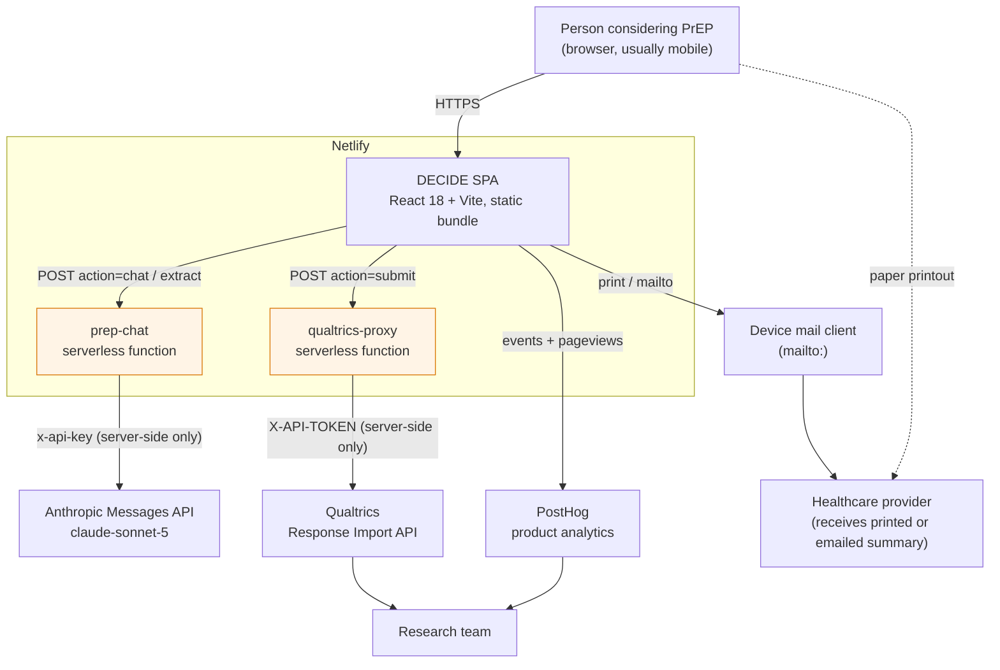
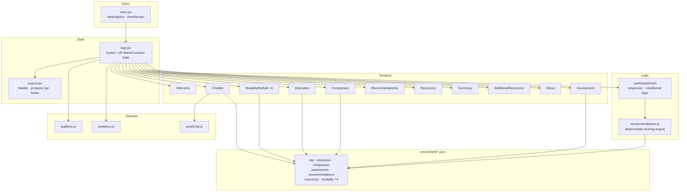
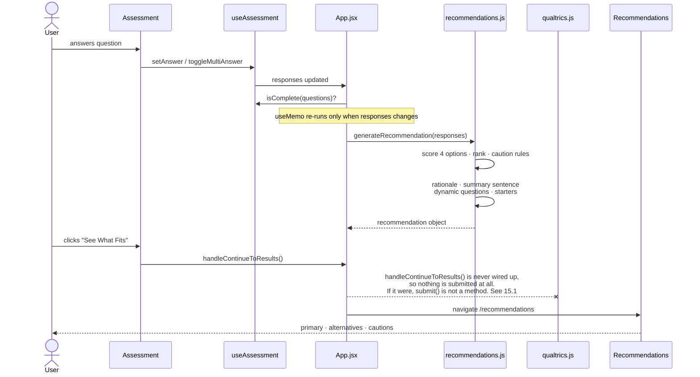
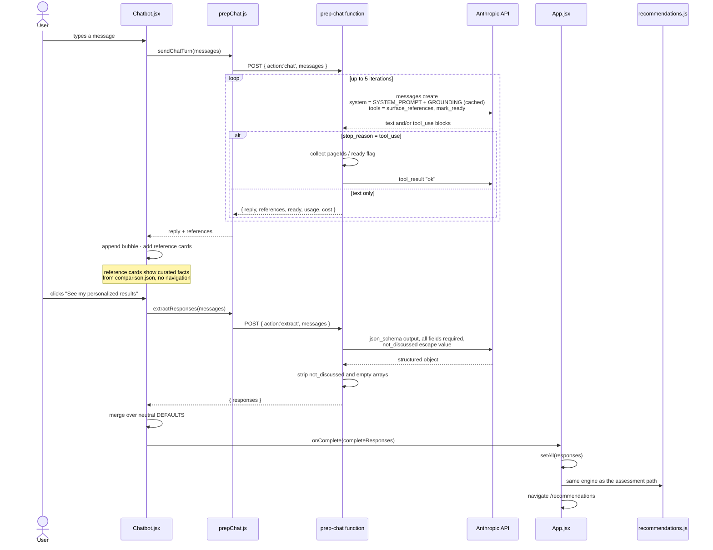
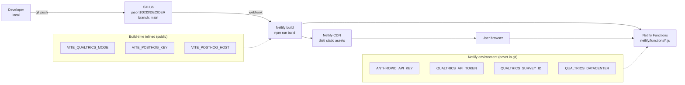
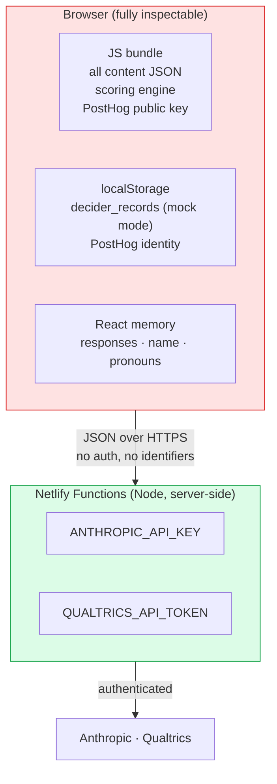

# DECIDE: PrEP Options Counseling
## Functional Specification, Technical Specification, and Systems Architecture

| | |
|---|---|
| **Document version** | 2.0 |
| **Date** | 19 August 2026 |
| **Status** | Baseline. Reflects `main` at commit `ce46322`. |
| **Repository** | https://github.com/jason10033/DECIDER (private) |
| **Package name** | `decider-prep-counseling` v1.0.0 |
| **Full name** | **DE**cision-aid for PrEP **C**hoice to **I**mprove **D**uration of **E**ngagement |
| **Study** | NIH R34, Columbia University Irving Medical Center / New York-Presbyterian. MPIs Delivette Castor and Jason Zucker. |
| **Development phase** | **IPDAS Phase 3 Initial Prototype.** See Section T5.1. |
| **Owner** | Jason Zucker |
| **Purpose of this document** | A complete handoff record. Someone who has never seen this codebase should be able to read this document, clone the repository, run it, change it, deploy it, and defend its theoretical basis to a study section without asking a question. |

### Maintenance protocol

This document is updated **weekly** and on any change to the deployed site. The update is mechanical:

1. Diff `main` against the commit named in the header above.
2. Update every section the diff touches. Sections 4, 5, 7, 8, and 11 are the ones that go stale first.
3. **If the change closes or opens a gap named in Section T9, update T9 in the same commit.** That section is the map between what the grant specifies and what exists, and it is the part of this document a new investigator will read first.
4. Add a row to the changelog in Section 14.
5. Bump the document version (minor for content changes, major for architectural changes) and the commit hash in the header.

A change that is not reflected here is a change that has not been handed over.

**Separate cadence: clinical content review.** The four `modality-*.json` files and `comparison.json` must be reviewed together against current CDC and NYSDOH guidance on a standing cadence, and the reviewer and date recorded. See Section T9.5 for why this is the project's likeliest failure mode.

---

## Table of contents

**Part 0: Theoretical foundation** *(source of record: the project's own R34 research strategy)*
- T1. Why the theory matters here, and what it obligates
- T2. The problem theory: choice proliferation, choice overload, and equity
- T3. The behavioural framework: **dyadic IMB**
- T4. The decision framework: ODSF and the three-talk model
- T5. IPDAS: a development process, not only a checklist
- T6. Technology theory: NASSS, Persuasive Systems Design, acceptance, equity
- T7. The implementation framework: CFIR
- T8. What the theory obligates you to measure
- T9. **Where the built app sits against the specified intervention** ← read this first
- T10. Evidence base and references

**Part I: Functional specification**
1. Purpose and scope
2. Users and stakeholders
3. The user journey
4. Screen-by-screen functional requirements
5. Clinical and business rules
6. Non-functional requirements

**Part II: Technical specification**
7. Technology stack and repository layout
8. Application state model
9. Content model (the JSON contract)
10. The recommendation engine
11. Serverless functions and external integrations
12. Configuration and environment variables

**Part III: Systems architecture**
13. Architecture diagrams

**Part IV: Handoff**
14. Build, run, deploy
15. Known gaps, risks, and backlog
16. Changelog

---

# Part 0: Theoretical foundation

> **Source of record.** The theory in this Part is not reconstructed from the code. It is taken from the project's own NIH R34 research strategy, *DECIDE: DEcision-aid for PrEP Choice to Improve Duration of Engagement* (MPIs Delivette Castor and Jason Zucker; co-investigators Kathrine Meyers and Magdalena Sobieszczyk; Columbia University Irving Medical Center / New York-Presbyterian). Where this document adds frameworks the grant does not name, they are marked **[extension]** and the reason for adding them is given.
>
> **Read Section T9 before anything else if you are inheriting this project.** The deployed application is a partial realisation of the intervention the grant specifies, and knowing which parts are missing is the difference between a useful handoff and a misleading one.

## T1. Why the theory matters here, and what it obligates

DECIDE is a patient decision aid. That is a defined class of intervention with an established theoretical base, an international quality standard, a prescribed development process, and a Cochrane evidence base of over two hundred randomised trials. Building one without naming the frameworks it implements is how a tool ends up as an attractive brochure with a quiz bolted on.

The grant is explicit that DECIDE is **"a theoretically driven, evidence-based, personalized, dyadic decision aid"**, and it names three frameworks:

| Framework | Role in the project | Grant section |
|---|---|---|
| **Information-Motivation-Behavioral Skills (IMB)**, applied **dyadically** | The behavioural model. Structures the BPSR, the client interview guides, and the client-side measures. | C.1.2, Figure 3 |
| **IPDAS**, as a **five-phase development process** | The development methodology. Figure 2 is the project's own phase diagram, and the specific aims are phases of it. | C, Figure 2 |
| **CFIR** | The implementation-evaluation lens. Structures provider interview guides and the Aim 3 implementation outcomes. | C.1.3, Table 2 |

Naming them does four concrete things:

1. It tells a developer **which behaviours are load-bearing** and must survive refactoring. The congruence filter in `generateSummarySentence` looks like a stylistic nicety; it is the values-clarification mechanism. The `considerations` list is not padding; it is the unrealistic-expectations control.
2. It gives the research team **the outcome measures**, rather than inventing them afterwards. Section T8 lists them.
3. It gives the clinical team **a defensible answer** to the two hardest questions a health department asks: why does this tool recommend anything at all, and how do you know it does not just push people toward the newest drug.
4. It tells whoever inherits the codebase **what to build next and why**, which is Section T9.

## T2. The problem theory: choice proliferation, choice overload, and equity

The grant's causal argument runs in four steps. Each one constrains the design.

### T2.1 The PrEP pipeline is expanding faster than the capacity to counsel about it

Daily oral, event-driven oral (2-1-1), two-monthly cabotegravir, six-monthly lenacapavir, with islatravir, vaginal rings, implants, and preventive vaccines behind them. The grant's framing: *"potential PrEP users could be faced with numerous dosing options and pharmaceutical products in the next five years."*

### T2.2 More choice does not automatically mean better decisions

> *"Evidence from other areas of medicine suggest an inverse relationship between increased information and/or task complexity and decision quality. This paradoxical effect of choice is hypothesized to be mediated through greater cognitive demand and decisional conflict."* (A.3)

The supporting real-world observation is the Amsterdam cohort: in the era of choice, younger PrEP users were more likely to switch from oral to event-driven, **and still more likely to discontinue altogether**. Switching is not the same as staying.

**[extension] The choice-overload literature is more useful here than a flat "too much choice is bad".** Scheibehenne, Greifeneder and Todd (2010) meta-analysed the effect and found a mean near zero: choice overload is not a universal law. Chernev, Böckenholt and Goodman (2015) resolved this by identifying four moderators that determine whether it appears at all:

| Moderator | Present in PrEP choice? | What DECIDE does about it |
|---|---|---|
| **Choice set complexity** | Yes. Four options differing on route, cadence, reversibility, privacy, cost, and eligibility. | The eleven-category comparison matrix and the head-to-head view reduce the set to two at a time |
| **Decision task difficulty** | Yes. Time-pressured, in a short visit, often same-day. | The tool moves Option Talk out of the visit entirely (T4.2) |
| **Preference uncertainty** | Yes. Most people have never articulated how they weigh privacy against needles. | This is exactly what the assessment is: an explicit values-clarification exercise |
| **Decision goal** | Mixed. Some clients are minimising effort, some are optimising. | The ranked result serves effort-minimisers; the full comparison and the selectable alternatives serve optimisers |

**This is the strongest available theoretical justification for DECIDE's most contested design decision, which is that it ranks the options.** The moderator literature says choice overload appears when the set is complex, the task is hard, and preferences are unformed. A decision aid that clarifies preferences and structures the comparison is attacking three of the four moderators directly. It is not merely presenting information; it is reducing the specific conditions under which more options make decisions worse.

### T2.3 Providers are a bottleneck, and choice makes it worse

The grant's own preliminary data (C.4.2, Get2PrEP3): **over 80% of surveyed providers said more HIV prevention options would make them *less* likely to recommend a medication-based option, and only 50% were confident guiding people to a method that worked for them.** Open-ended responses centred on increased time and educational burden.

> *"In designing DECIDE we aim to determine if providing information about PrEP options directly to patients reduces the educational burdens and time spent required by providers."* (C.4.2)

**This is why DECIDE is dyadic rather than patient-facing.** It is not a courtesy to providers. The grant's position, supported by two of its own provider-side studies (Get2PrEP2, where an interpretive lab comment did not increase PrEP referrals or prescriptions though it did increase documentation of safe-sex and condom counselling; and Get2PrEP3, where provider e-mails produced a modest 7% increase in PrEP discussions or referrals), is that:

> *"Given the limited impact of provider side interventions to increase PrEP uptake, combined with the documented role providers play in PrEP uptake, DECIDE must be dyadic, supporting both the client and provider, especially in settings not routinely providing HIV prevention services."* (C.4.1)

### T2.4 Expanded options can widen disparities rather than narrow them

Most new HIV infections occur in racial and ethnic minorities, yet Black/African American and Hispanic/Latinx MSM comprise only 28% of people prescribed PrEP, and are persistent about half as often as white counterparts. At the project's own NYP clinic, PrEP use was lower among Latino (26%) and Black (30%) than white (35%) MSM, with higher disengagement among Black MSM. In a representative NYC sample, Black and LatinX MSM were **nearly four times more likely** to view talking to a doctor about their sex life as a barrier, and **almost half as likely to endorse agency in medical decision-making**.

> *"Conceivably, racial and ethnic disparities in PrEP uptake and persistence could be exacerbated in the context of choice if barriers to uptake and persistent use, like self-efficacy with talking to one's doctor and ongoing risk perception, is not addressed."* (A.5)

**This is the equity rationale for the conversation-starter generator**, which is otherwise the least obviously necessary feature in the tool. Self-efficacy for talking to a provider about sex is a measured, racially patterned barrier. A pre-written, selectable opener is a low-cost, direct intervention on it. Anyone tempted to cut that feature for simplicity should read this paragraph first.

## T3. The behavioural framework: dyadic IMB

**The grant's primary theoretical framework is the Information-Motivation-Behavioral Skills model** (Fisher and Fisher, 1992), applied in a form the grant states is novel:

> *"To date the IMB model has not been applied to the client-provider dyad."* (C.1.2)

IMB holds that a person adopts and sustains a health behaviour when they are **informed**, **motivated**, and possess the **behavioural skills** to act. Information and motivation are largely independent inputs; behavioural skills are the proximal determinant. The model's practical value is that it separates three failure modes that look identical from the outside: a person who does not know, a person who does not want to, and a person who wants to and cannot.

### T3.1 The dyadic model, both sides

The grant's Figure 3 places the same three constructs on both sides of the encounter, with DECIDE-informed feedback flowing between them.

| | **Client** | **Provider** |
|---|---|---|
| **Information** | Knowledge about each modality; frequency and logistics of clinic visits by modality; understanding out-of-pocket cost by modality | PrEP eligibility criteria; knowledge about each modality; visit intensity and logistics by modality; understanding out-of-pocket cost by modality |
| **Motivation** | Self-perceived risk; attitudes and beliefs about each modality; social norms; competing life priorities | Perceived risk of HIV for the patient; attitudes and beliefs about each modality; social norms; competing visit priorities |
| **Behavioural skills** | Communicating values and preferences; asking clarifying questions about options; self-efficacy; comparing options to make an informed choice | Eliciting patient values and preferences; communicating options; assessing patient understanding of options; evaluating patient self-efficacy; assessing patient uncertainty among options |

Feedback cadence differs by side: **monthly to the client, pre-visit to the provider**, both via the BPSR.

### T3.2 What IMB obligates the software to do

This mapping is the most operationally useful thing in Part 0, because it says which code exists for which theoretical reason.

| IMB construct | Side | Implemented by | Notes |
|---|---|---|---|
| Information: modality knowledge | Client | `/education`, four `/learn/*` deep dives, `education.json`, `modality-*.json` | |
| Information: visit logistics | Client | `comparison.json` categories "How Often", "Where", "Clinic Visits" | |
| Information: out-of-pocket cost | Client | `cost_access` section in every modality file; the "Help Paying for PrEP" resource category | Weak. Nothing is personalised to the `prep_10` insurance answer. See T9.3. |
| Motivation: self-perceived risk | Client | **Not elicited.** | The assessment has no risk-perception item, despite decreased perceived risk being the second most common discontinuation reason in the grant's own data (29%). See T9.3. |
| Motivation: attitudes and beliefs by modality | Client | `prep_08` concerns, `prep_05` privacy, `prep_03` needle attitude | |
| Motivation: competing life priorities | Client | `prep_04` visit-frequency tolerance | Partial |
| Behavioural skill: communicating values and preferences | Client | The physician-view Summary, written in the third person with chosen pronouns | This is a **skill substitute**: the tool speaks for the client. See T3.3. |
| Behavioural skill: asking clarifying questions | Client | `generateDynamicProviderQuestions()` plus the custom-question field | |
| Behavioural skill: self-efficacy | Client | `generateDynamicConversationStarters()` | The direct response to the disparity in T2.4 |
| Behavioural skill: comparing options to make an informed choice | Client | `Comparison.jsx` overview and head-to-head views | |
| Information and Motivation, provider side | Provider | The physician-view Summary only | Thin. No eligibility criteria, no per-modality logistics, no cost reference for the provider. See T9.3. |
| Behavioural skill: eliciting patient values | Provider | The physician-view Summary delivers the elicited values pre-formed | Again a substitute rather than a skill-builder |
| Behavioural skill: assessing patient uncertainty among options | Provider | **Not implemented.** The provider never sees how close the scores were. | The engine computes `allScores` and attaches it to `primary`. Rendering it would be a small change with real theoretical justification. See T9.3. |

### T3.3 The substitution question, stated plainly

Several behavioural-skill cells above are marked "skill substitute". This is a genuine theoretical tension worth recording rather than glossing.

IMB says behavioural skills are the proximal determinant of sustained behaviour. A tool that performs the skill *for* the client (speaking their preferences in clinical language on their behalf) improves the immediate encounter but does not obviously build the skill for the next one. A tool that *rehearses* the skill (the conversation starters, which the client selects and then says themselves) does.

DECIDE does both, and the balance is currently tilted toward substitution. **Whether substitution or skill-building better serves the grant's primary outcome, which is duration of engagement over 6 and 9 months, is an empirical question this project is well placed to answer and has not yet framed as one.** If engagement is the outcome, skill-building should probably win, because the client attends many visits and the tool is only present at some of them.

## T4. The decision framework: ODSF and the three-talk model

IMB explains behaviour. It does not tell you what a good decision looks like. Two decision-science frameworks supply that, and both are what make DECIDE a *decision aid* rather than a health-education app.

### T4.1 The Ottawa Decision Support Framework

The ODSF (O'Connor and colleagues; 20th-anniversary update, Hoefel et al. and Stacey et al., 2020) is the most widely used theoretical basis for patient decision aids, and is one of the intellectual antecedents of the IPDAS quality criteria. Three sequential elements: **assess decisional needs → provide decision support → evaluate decision quality**. Unresolved decisional needs cause decisional conflict; decisional conflict causes delay, regret, and blame; targeted support resolves the needs. Decision quality is defined as **informed, values-congruent choice**.

The grant's mechanism ("greater cognitive demand and decisional conflict", A.3) is the ODSF's mechanism, and its client-level secondary outcome is the ODSF's own instrument.

| ODSF decisional need | How DECIDE addresses it | Where in the code |
|---|---|---|
| **Inadequate knowledge** | Learn page, four deep dives, eleven-category comparison | `education.json`, `modality-*.json`, `comparison.json` |
| **Unrealistic expectations** | Every option template carries `considerations` alongside `reasons`, presented symmetrically | `recommendations.json` |
| **Unclear values** | The eleven-question assessment; `prep_09` forces a single-priority trade-off | `assessment.json`, `useAssessment.js` |
| **Inadequate support and resources** | Provider questions, conversation starters, physician-view summary, resource directory | `recommendations.js`, `Resources.jsx`, `Summary.jsx`, `resources.json` |
| **Unclear what matters most** | The congruence-filtered summary sentence names back the client's own values | `generateSummarySentence()` |
| **Difficult decision-making role** | Framing throughout: "a decision you and your healthcare provider make together" | `assessment.json`, `Recommendations.jsx` |

**Two of these are the parts most likely to be broken by a well-meaning simplification.**

**Values clarification.** Witteman et al. (2021), an updated systematic review and meta-analysis of 33 studies, found that explicit values clarification methods improve values-congruence of choice and reduce decisional conflict relative to decision aids without them. DECIDE uses an implicit-to-explicit hybrid: the assessment elicits attribute-level preferences, and the summary sentence reflects them back in the client's own terms. **The design rule in `generateSummarySentence` is that only factors genuinely supporting the recommended option are named**, so the sentence never reads as though the tool overrode the person. That rule is a values-clarification decision, not copy-editing.

**Unrealistic expectations.** Removing "Things to consider" from the Results screen to simplify the page would convert the tool from a decision aid into a promotional interface. It is a framework requirement.

### T4.2 Elwyn's three-talk model

The ODSF explains what the *tool* must do. Elwyn's three-talk model (BMJ 2017) explains what the *encounter* must do, and DECIDE is explicitly designed to pre-load two of its three stages. This is the mechanism by which the grant's provider-burden problem (T2.3) is addressed.

| Three-talk stage | What it requires | What DECIDE contributes |
|---|---|---|
| **Team talk** | Establish that a choice exists and that the client's preferences matter | The conversation starters, especially *"I used a decision tool that helped me think about my PrEP options. Can I share what I learned with you?"* This is a scripted Team Talk opener handed to the person with the lowest measured self-efficacy for starting it. |
| **Option talk** | Compare the alternatives and their trade-offs | **Done before the visit.** The comparison matrix, deep dives, and selected-alternatives list mean the clinician does not deliver Option Talk cold in a fifteen-minute slot. This is the direct answer to the 80% of providers who said more options would make them less likely to recommend one. |
| **Decision talk** | Elicit preferences and arrive at a decision together | Deliberately left to the clinician. DECIDE supplies the inputs and stops. |

This is why the output is an artefact rather than a verdict, and why the physician view is third-person with chosen pronouns: it is designed to be *handed over* at the start of Decision Talk.

### T4.3 [extension] Dual-process reasoning

The grant notes that co-investigator Meyers *"has outlined the challenges of PrEP choice including the integration of dual-process models, mitigation of bias, and tools to support patient-centered communication."* Dual-process accounts (Kahneman; Croskerry in clinical medicine) distinguish fast, associative, heuristic-driven System 1 reasoning from slow, deliberative System 2 reasoning.

The relevance is specific and not decorative. **A decision aid can either exploit System 1 or recruit System 2, and DECIDE does both in different places:**

- The **ranked top match with a colour-coded card** is a System 1 affordance. It is fast, it anchors, and it is what makes the tool usable for someone with five minutes in a waiting room.
- The **eleven-question assessment, the eleven-category comparison, and the "Things to consider" list** are System 2 recruitment. They are slow and effortful by design.
- The **congruence-filtered rationale** is the bridge: it makes the System 1 output inspectable by System 2, so the person can disagree with the reasoning rather than only with the conclusion.

The residual risk, which is real and untested, is **anchoring**: a ranked result may anchor a client who would otherwise have deliberated. The honest framing is that DECIDE is a decision aid with a preference-matching layer, and that layer should be evaluated on whether it improves or degrades values-congruence relative to the same content presented unranked. That is a testable question and it has not been tested.

## T5. IPDAS: a development process, not only a checklist

**This is the correction most worth absorbing.** The previous version of this document treated IPDAS as a conformance checklist. The grant treats it as the **development methodology**, and Figure 2 is the project's own phase diagram. Both readings are correct and they are different instruments.

### T5.1 IPDAS as process (Coulter et al., 2013; Witteman et al., 2021)

The systematic development process for patient decision aids has a consistent shape across the field: scoping and design, prototype, alpha testing with people involved in development, beta testing in real conditions with people who were not, and production of a final version, all overseen by a multidisciplinary steering group and documented throughout.

**The grant's Figure 2 instantiates it in five phases, and the specific aims are literally phases of it:**

| Phase | Content | Status |
|---|---|---|
| **1. Define the scope, purpose and target audience** | | **Complete** |
| **2. Assemble an advisory group** | Harlem Pride, NYC HIV Prevention Community Advisory Board (letters of support) | **Complete** |
| **3. Design** | 3.1 Assess patient views on content and decisional needs · 3.2 Assess provider views · 3.3 Synthesise evidence, determine format and distribution | **Aim 1.** Partly complete; the current build is the Initial Prototype. |
| → **Initial Prototype** | | **This codebase** |
| **4. Alpha testing** | Usability testing | **Aim 2.** Not started. |
| **5. Beta testing** | Preliminary efficacy RCT | **Aim 3A and 3B.** Not started. |

**The consequence for a developer is direct: this codebase is a Phase 3 prototype, not a product.** It is expected to be substantially rewritten after Aims 1 and 2. That is the reason to keep the content-versus-code boundary in Section 7.3 clean, and it is the reason not to over-invest in polish before alpha testing.

### T5.2 Alpha testing has a specified method

Aim 2 is not "get some feedback". The grant specifies:

- A **digital beta built in Articulate Rise**. The current build is React and Vite. **This is an unresolved decision and it is consequential**: Articulate Rise is an authoring tool that non-developers can edit, which matches the content-owned-by-clinicians model, but it cannot host the recommendation engine or the chatbot. See T9.4.
- **Heuristic evaluation** by five bioinformatics experts from the CUIMC Department of Bioinformatics, using a Heuristic Evaluation Checklist based on **ten recommended heuristics for usable interface design**. **[extension]** These are Nielsen's ten usability heuristics (1994): visibility of system status, match between system and the real world, user control and freedom, consistency and standards, error prevention, recognition rather than recall, flexibility and efficiency of use, aesthetic and minimalist design, help users recognise and recover from errors, and help and documentation.
- **Think-aloud protocol with the five usability experts**, who experience the aid as both client and provider while describing what they are thinking, seeing, and trying to do; interactions and vocalisations are recorded to surface problems static screenshots miss. Separately, **20 clients and 5 providers** give end-user feedback through private semi-structured interviews, with guides built on IMB (clients) and on IMB plus CFIR (providers).
- Iterate **until no new changes are made**, then freeze for Aim 3.

**[extension] Nielsen's heuristics are the right lens for this codebase and two of them are already at risk.** *Visibility of system status*: the assessment's forward button is disabled at 50% opacity with no message explaining what is unanswered. *Error prevention and recovery*: a client who changes an assessment answer after selecting questions gets a silently different question list (Section 15.2). Both would surface immediately in heuristic evaluation, and both are cheap to fix now.

### T5.3 IPDAS as checklist: honest self-audit

Separately from the process, IPDAS is the field's quality standard (Elwyn et al., 2006; Joseph-Williams et al., 2014; Evidence Update 2.0, Stacey and Volk, 2021), separating qualifying criteria (a tool is not a decision aid without these), certifying criteria (serious risk of harmful bias without these), and quality criteria.

| IPDAS criterion | Status | Evidence or gap |
|---|---|---|
| **Qualifying** | | |
| Describes the health condition | Met | `/education`, three accordion sections |
| Describes the decision to be considered | Met | Welcome and Assessment intro copy |
| Lists the options | Met | All four modalities. **"Not starting PrEP" is not presented.** |
| Describes positive and negative features of each | Met | `reasons` and `considerations` for all four |
| **Certifying** | | |
| Presents outcome probabilities in an unbiased, understandable way | **Partial** | Effectiveness is prose ("96% reduction in HIV risk in clinical trials"; "even more effective than daily pills"). No event rates, no common denominator, no visual risk display. **The largest IPDAS gap**, and the one most likely to be flagged by an expert reviewer. |
| Includes methods to clarify and express values | Met | The assessment plus the congruence-filtered summary |
| Includes structured guidance for deliberation and communication | Met | Prepare screen and dual-view Summary |
| **Quality** | | |
| Plain language | Met | Consistently low reading level; no formal readability audit |
| Balanced presentation | **Partial** | Presentation is balanced; the ranking is not neutral by design. Defensible (T2.2, T4.3), but must be declared. |
| Discloses funding source and conflicts of interest | **Not met** | The About page does not disclose the NIH R34, the institution, or COI. Straightforward fix. |
| Provides evidence sources and an update policy | **Not met** | No citations, no "last reviewed" date, no named clinical reviewer anywhere in the interface |
| Reports the development process | **Not met** | Not described in the tool, despite a documented five-phase process existing |
| Includes the option of doing nothing | **Not met** | A clinical design decision, not an oversight; make it deliberately |
| Field-tested with users and clinicians | **Planned** | Aim 2 |
| Available in the languages of the target population | **Not met** | The grant commits to **English and Spanish**. The build is English only, with no i18n scaffolding. |

**Five of these are non-code content work and are the highest-value tasks available on this project right now.** Funding disclosure, evidence sources with a review date and named reviewer, and a development-process description are three paragraphs in `About.jsx`. Spanish is a build task that gets harder the longer the content files grow.

## T6. [extension] Technology theory: why a good decision aid still fails as software

The grant names IMB, IPDAS, and CFIR. **It does not name a technology-adoption framework, and that is the gap this section fills.** The justification is in the grant's own text: it worries explicitly about **transportability** (*"Interventions that demonstrate efficacy and fail to be scaled for public health impact, often are resulting from lack of stakeholder and community engagement as well as less attention to transportability"*), it has a distribution strategy that depends on third-party platforms (AVAC PrEP Watch, BLUPrInt, the patient portal), and it made a deliberate architectural choice to sit outside the EMR. Those are technology-adoption questions, and there are frameworks for them.

### T6.1 NASSS: the framework for whether this will spread at all

The **NASSS framework** (Greenhalgh et al., JMIR 2017) explains nonadoption, abandonment, and failure to scale up, spread, and sustain health technologies. Its core claim: healthcare is a complex adaptive system, and **the more complexity in each domain, the less likely the technology sustains**. Its practical use is as a complexity audit before scaling.

| NASSS domain | DECIDE's complexity | Assessment |
|---|---|---|
| **Condition** | HIV prevention in people who are well. No symptom driving urgency, and perceived risk fluctuates (29% of the grant's discontinuations). | **Complicated.** Motivation is not supplied by the condition; it has to be supplied by the intervention. |
| **Technology** | Static web app, no accounts, no PHI, no EMR write-back, no dependency beyond a browser. | **Simple. This is DECIDE's single greatest asset for spread**, and it is a direct consequence of the C.4.7 finding that users refused a downloadable app and wanted it inside platforms they already use. |
| **Value proposition** | To the client: a clearer decision. To the provider: less unpaid counselling time. To the clinic: PrEP uptake and engagement. | **Straightforward for client and provider; unproven for the clinic.** No business case exists because no efficacy data exists. This is what Aim 3 is for. |
| **Adopter system** | Clients (no training, no account), providers (a short online training module in Aim 3B), clinic staff (none). | **Simple on the client side, complicated on the provider side.** The BPSR requires a provider to open, read, and act on it inside a visit. That is the adoption risk. |
| **Organisation** | Deliberately outside the EMR to avoid the EMR change queue. Distribution via portal link and third-party websites. | **Simple by design, and this was the right call.** The grant is explicit: *"Being external to the EMR will allow us to make rapid changes as we learn."* |
| **Wider context** | EHE 2030 targets, CDC guidance, NYS DOH guidance, a drug pipeline that changes annually. | **Complex, and it is the main sustainability threat.** Content goes stale on someone else's schedule. There is currently no review cadence and no "last reviewed" date. |
| **Embedding and adaptation over time** | Monthly BPSR cadence implies indefinite institutional ownership of content accuracy. | **Complex, and unaddressed.** See T9.5. |

**The NASSS audit produces one clear conclusion.** DECIDE is unusually simple in the domains that usually kill health technologies (technology, organisation) and complex in the two that are usually underestimated (wider context, embedding over time). **Its likeliest failure mode is not nonadoption. It is content decay: a live tool giving 2026 advice in 2029.** Nothing in the current build, and nothing in the grant, assigns ownership of that. Section T9.5 proposes the minimum viable answer.

### T6.2 Persuasive Systems Design: naming what the tool does to behaviour

The **Persuasive Systems Design model** (Oinas-Kukkonen and Harjumaa, 2009) is the standard vocabulary for the features by which software changes behaviour, in four categories: primary task support, dialogue support, system credibility support, and social support. It is worth applying here because it makes DECIDE's design choices nameable and, more usefully, exposes which categories are empty.

| PSD category | Principle | In DECIDE |
|---|---|---|
| **Primary task** | Reduction (complex task to simple) | The eleven questions reduce a four-way multi-attribute comparison to a ranked result |
| | Tailoring | Every recommendation, rationale, question list, and starter list is generated from the client's own answers |
| | Personalisation | Name and pronouns in the physician view; custom questions |
| | Self-monitoring | **Absent in the build. This is exactly what the monthly BPSR is.** |
| **Dialogue** | Praise, rewards, reminders, suggestion | **Almost entirely absent.** The grant's monthly text message is the reminder; the chatbot pilot is the only dialogue feature that exists. |
| | Similarity, liking | Not used |
| **System credibility** | Trustworthiness, expertise, surface credibility | **Weak, and it maps exactly onto the unmet IPDAS criteria in T5.3.** No named clinical reviewer, no citations, no institutional attribution, no review date. Credibility is a persuasion variable, not just a compliance box. |
| | Third-party endorsement | **Planned but not built.** Distribution via AVAC PrEP Watch and BLUPrInt is itself third-party endorsement, and it is currently absent from the interface. |
| **Social support** | Social comparison, normative influence | Not used, and arguably should not be for a stigmatised health behaviour |

**The PSD audit says the same thing the IPDAS audit says from a different direction:** the highest-value missing features are credibility markers, and they cost three paragraphs. It also shows that the BPSR is not a nice-to-have report but the tool's entire self-monitoring capability, which is the PSD principle most associated with sustained behaviour.

### T6.3 Acceptance, usability, and the sociotechnical view

Three more lenses, each with one specific thing to say.

**Technology Acceptance Model / UTAUT** (Davis 1989; Venkatesh et al. 2003). Adoption is driven by perceived usefulness and perceived ease of use, extended in UTAUT to performance expectancy, effort expectancy, social influence, and facilitating conditions. **The grant's C.4.7 interviews are a TAM finding in all but name:** across 12 qualitative interviews, prospective users were uniformly supportive of the functionality, but most did not want a free-standing app they would have to download, asking instead for it to be built into platforms they already use such as their patient portal. Effort expectancy, not performance expectancy, determined the architecture. **The lesson generalises to the next decision: anything that adds an account, a download, or a login will be resisted on the same grounds.**

**Nielsen's heuristics and think-aloud** are already the Aim 2 method. See T5.2.

**The sociotechnical model** (Sittig and Singh, 2010) covers eight dimensions of health IT safety. Two are live here: **workflow and communication** (the BPSR has to arrive at a moment a provider can act on it, which is the pre-visit cadence in Figure 3 and is not built), and **people** (provider training is what makes the provider side of the IMB model actionable, and neither form is built: a short training on HIV prevention counselling and PrEP recommendations embedded in the provider e-mail in Aim 3A, and an online training module covering SDM plus a live session with a study team member in Aim 3B).

**[extension] Digital equity.** The grant's whole rationale is a disparity, so the delivery mechanism must not reintroduce one. The build is on the right side of most of this: no download, no account, no minimum device, no data cost beyond a page load. Three risks remain and should be tracked as design constraints:

1. **Language.** English only against an English-and-Spanish commitment (T5.3).
2. **Reading level.** Never formally audited. The grant's population includes clients for whom self-efficacy with clinical conversation is already a measured barrier.
3. **The chatbot pilot.** Free-text conversation in English privileges written fluency in a way the structured assessment does not. If the chatbot path is evaluated, it should be evaluated **for differential performance by race, ethnicity, and language**, not only in aggregate. This is a real and specific equity risk in the newest feature and it is worth stating before the data exists.

## T7. The implementation framework: CFIR

The grant uses **CFIR** (Damschroder et al.; the grant cites the original five-domain, 39-construct version, updated in 2022 to 48 constructs) for the implementation side: to structure the provider interview guide in Aim 1, to co-structure it with IMB in Aim 2, and to define the implementation outcomes in Aim 3.

| CFIR domain | Aim 1 and 2 provider-guide use | Aim 3 outcome measures (grant Table 2) |
|---|---|---|
| **Intervention characteristics** | Provider interview guide | Feasibility, acceptability, appropriateness, relative advantage |
| **Inner setting** | Provider interview guide | Readiness to use DECIDE, absorptive capacity, available resources |
| **Characteristics of individuals** | Provider interview guide | Knowledge, self-efficacy, state of change, motivation, values |
| **Process** | Workflow integration questions | Fidelity of implementation |
| **Outer setting** | Context | Not separately measured in Table 2 |

The grant's stated questions are concrete and worth reproducing, because they are what a developer should be designing for: *"when to use DECIDE within the clinic workflow, how providers will interact with DECIDE to facilitate SDM conversations, what inner and outer context factors may facilitate or challenge integration of DECIDE into clinic workflow."*

**The division of labour in the grant's instrument design shifts across aims, and it is worth reading precisely.** In **Aim 1**, client interview guides are built on IMB and provider guides on CFIR alone (C.5). From **Aim 2 onward the provider instruments are dual-framework**: the Aim 2 provider guide "is based on the IMB and CFIR model" (C.6), and the Aim 3A provider survey "will include domains of the IMB model and the CFIR model as outlined in Table 2" (C.7.1).

So the provider side of Figure 3 **is** instrumented, from Aim 2 on. What it lacks is a **separate row in Table 2**: the provider IMB constructs are folded into the CFIR "Individual characteristics" row (knowledge, self-efficacy, state of change, motivation, values), which is where they are measured. That is defensible, since the constructs overlap. It is worth being aware of if the dyadic IMB claim is being presented as the novel contribution, because the analysis plan will need to pull those constructs out of a CFIR-labelled row to report them as IMB.

## T8. What the theory obligates you to measure

Every framework above carries instruments. This table is the complete measurement model, drawn from the grant's Table 2 where it exists and flagged where it does not.

| Construct | Instrument | Source | Instrumented in the build? |
|---|---|---|---|
| **Primary, Aim 3A** | PrEP discussion or initiation within one month of STI diagnosis | Chart review, EMR | n/a, clinical |
| **Primary, Aim 3B** | Engagement, measured by **Visit Constancy at four-month intervals (VC4)** | EMR. The grant applied three commonly used engagement metrics retrospectively to NYP-HPP oral PrEP patients and found VC4 had excellent internal correlation. | n/a, clinical |
| **Decisional conflict** | **Decisional Conflict Scale** (O'Connor, 1995): 16 items, five subscales (informed, values clarity, support, uncertainty, effective decision) | ODSF; grant Table 2 | **No** |
| **Shared decision making, client-perceived** | Client survey | Grant Table 2 | **No** |
| **Shared decision making, observed** | **OPTION scale** (Elwyn et al., 2003; 2005), independent rater on a subset of 10 recorded dyads | Grant Table 2, "Secondary 3B (Dyad)" | **No** |
| **IMB constructs, client** | PrEP information, motivations, behaviors | Grant Table 2 | **No** |
| **IMB constructs, provider** | Knowledge, self-efficacy, state of change, motivation, values. Instrumented from Aim 2 on, via provider guides and surveys built on IMB **and** CFIR. | Grant Table 2, folded into the CFIR "Individual characteristics" row | **No** |
| **Implementation** | Feasibility, acceptability, appropriateness, relative advantage, readiness, absorptive capacity, fidelity | CFIR; grant Table 2 | **No** |
| **Exposure / dose** | Duration and frequency of DECIDE use | Grant Table 2, from the web app | **Partial.** PostHog captures pageviews and one `chatbot_completed` event. There is no session identifier tying use to a client, and by design there cannot be one without an accounts model. |

**[extension] Two instrument recommendations.**

**Use the SURE test rather than the full DCS for in-app capture.** The Decisional Conflict Scale is 16 items and will cause dropout at the end of a web flow. The 4-item SURE test measures the same construct and is designed for exactly this. Keep the full DCS for the interviewer-administered arms.

**Consider the Dyadic OPTION scale.** Observer OPTION requires recording ten encounters and a trained rater, which the grant budgets for on a subset. A **Dyadic OPTION** variant exists, measuring *perception* of shared decision making from both client and provider, and it can be administered as a survey to every dyad rather than a rater to ten. Given that DECIDE's novel claim is dyadic, measuring the dyad's perception at scale alongside observer-rated SDM on a subset is a stronger design than either alone.

> **Everything in this table with "No" in the last column is blocked behind the same defect.** Section 15.1 records that `handleContinueToResults()` is never wired up and that `qualtricsService.submit` does not exist, so **no response has ever been recorded from either path**. That is not merely a bug. It is the critical path for the entire measurement model, and it should be the next commit.

## T9. Where the built app sits against the specified intervention

**This is the most important section in Part 0 for anyone inheriting the project.** The deployed application is the Phase 3 Initial Prototype. It is a partial realisation of the intervention the grant describes, and several theoretically central components do not exist.

### T9.1 Built and theoretically justified

| Component | Framework justification |
|---|---|
| Four-modality education and comparison | IMB Information, client side |
| Eleven-question preference assessment | ODSF values clarification; IMB Motivation |
| Deterministic ranked recommendation with congruence-filtered rationale | ODSF decision quality; choice-overload moderators (T2.2); dual-process bridge (T4.3) |
| Generated provider questions | IMB behavioural skill: asking clarifying questions |
| Generated conversation starters | IMB behavioural skill: self-efficacy. **The equity intervention** (T2.4) |
| Dual-view Summary, patient and physician | Three-talk handoff (T4.2). **A precursor of the BPSR.** |
| No account, no download, browser-only | C.4.7 user preference (most of 12 interviewees); NASSS technology simplicity; TAM effort expectancy |

### T9.2 Specified in the grant, not built

| Missing component | Framework it serves | Consequence of its absence |
|---|---|---|
| **The BPSR as a persistent, monthly, per-client report** | The IMB feedback loop, both sides (Figure 3). PSD self-monitoring. | **The single largest gap.** The physician-view Summary is a one-shot, in-session precursor. It is not monthly, not persisted, not carried between visits, and not shareable to a portal. Without it, the dyadic IMB model is aspirational rather than implemented. |
| **Monthly re-contact by text with a link** | IMB reinforcement; PSD reminders; the grant's C.4.5 finding that 21% of disengaged patients wanted to be contacted by a coordinator | No mechanism to re-reach a client between visits, which is where the grant argues engagement is won or lost |
| **Client identity and longitudinal state** | Prerequisite for both of the above, and for the "reduced burden" design where the client confirms whether anything changed since last month rather than re-answering | **This is an architectural fork, not a feature.** Anonymity is currently a privacy promise made on screen. Adding identity changes the tool's regulatory posture. See T9.6. |
| **Sharing to the provider via the EMR portal** | Three-talk Decision Talk; sociotechnical workflow | The summary reaches the provider only if the client prints or emails it |
| **Provider training module** | IMB provider side; CFIR individual characteristics | The provider half of Figure 3 has no intervention attached |
| **Spanish** | Grant commitment; digital equity | Excludes part of the target population |
| **Personalised cost and coverage information** | IMB Information, both sides. Cost was the **most common** discontinuation reason in the grant's own data (31%). | `prep_10` is collected, scored, and echoed back in the Summary, but **no cost or coverage content anywhere in the tool varies by the answer** |
| **Risk-perception elicitation** | IMB Motivation, client. Decreased perceived risk was the **second** most common discontinuation reason (29%). | The assessment has no risk item at all |
| **Distribution via AVAC PrEP Watch and BLUPrInt** | NASSS spread; PSD third-party endorsement | Planned, not present |

### T9.3 Small, high-value changes with direct theoretical justification

Each of these is hours of work and closes a named gap.

1. **Show the provider how close the scores were.** `generateRecommendation` already computes and attaches `allScores`. Rendering it in the physician view implements the IMB provider behavioural skill *"assessing patient uncertainty among options"*, which is currently unimplemented.
2. **Tailor the cost line to `prep_10`.** The answer is already collected. Cost is the leading discontinuation reason.
3. **Add a risk-perception item.** One question, closing the largest IMB Motivation gap.
4. **Add credibility markers to `About.jsx`.** Funding, institution, named clinical reviewer, last-reviewed date, evidence sources, development process. Closes four IPDAS criteria and the PSD credibility category at once.
5. **Add the 4-item SURE test to the Summary screen.** The first outcome measure the tool would actually produce. Blocked behind Section 15.1.

### T9.4 The Articulate Rise question

The grant specifies the Aim 2 digital beta be built in **Articulate Rise**. This codebase is React and Vite. The tension is real and should be decided explicitly rather than by default:

- Articulate Rise is authorable by non-developers, which fits the content-owned-by-clinicians model that Section 7.3 already implements through the JSON content boundary.
- Articulate Rise **cannot host the deterministic recommendation engine, the dynamic question generation, or the chatbot.** Those are the parts of DECIDE that make it a decision aid rather than a course.

**The likely correct answer is a hybrid**: Rise for the linear educational modules, this React app for the assessment, engine, and summary, presented as one flow. That should be decided before Aim 2 rather than discovered during it, because it determines what usability testing is testing.

### T9.5 The content-decay problem, which nobody currently owns

The NASSS audit (T6.1) identifies content decay as DECIDE's likeliest failure mode: a live tool giving stale advice in a field where the drug pipeline changes annually. The grant does not assign ownership. The minimum viable answer is three things, none of them expensive:

1. A **`lastReviewed` date and a named reviewer** in `site.json`, rendered in the footer and on the About page. This is also an unmet IPDAS criterion and a PSD credibility marker, so it pays for itself three times.
2. A **standing review cadence** (twice yearly is proportionate) against CDC and NYSDOH guidance, with the reviewer named in the changelog of this document.
3. A **rule that the four `modality-*.json` files and `comparison.json` are reviewed together**, because `comparison.json` also generates the chatbot's factual grounding. An edit to one without the others produces a tool that contradicts itself.

### T9.6 The identity fork, stated as a decision rather than a task

The tool currently promises on screen: *"This tool does not collect or store any personal health information. Your answers are used only during this session to generate your personalized results and are not saved or shared."*

The grant's intervention requires monthly per-client reports and portal sharing, which requires identity and persistence. **These are not compatible, and the resolution is a decision for the PIs and the IRB, not for a developer.** The options, with their consequences:

| Option | Consequence |
|---|---|
| Keep the tool anonymous; the BPSR lives in REDCap or the EMR, populated separately | Preserves the current privacy posture and the NASSS technology simplicity. The web app stays a static bundle. Costs a second system and a linkage. |
| Add study-scoped identity (a token issued at enrolment, no account) | Enables monthly re-contact and the BPSR within the study. Requires changing the on-screen privacy text, and changes the tool's regulatory posture. |
| Full accounts | Contradicts the C.4.7 user finding directly, and TAM effort expectancy predicts resistance. Not recommended. |

Whichever is chosen, **the on-screen privacy claim in `site.json` must change in the same commit as the code.** A tool that says it saves nothing while saving something is a consent failure, not a copy inconsistency.

## T10. Evidence base and references

### T10.1 The evidence DECIDE stands on

The Cochrane review of patient decision aids (Stacey et al., 2024) covers **209 randomised trials, 107,698 participants, 71 decisions**. Compared with usual care, decision aids:

- improve knowledge (MD **11.90/100**, high-certainty, 107 studies, 25,492 participants)
- improve accuracy of risk perception (RR **1.94**, high-certainty, 25 studies, 7,796 participants)
- reduce feeling uninformed (MD **-10.02**) and indecision about personal values (MD **-7.86**)
- probably increase congruence between informed values and care choice (RR **1.75**, moderate-certainty, 21 studies, 9,377 participants)
- reduce passive decision-making (RR **0.72**)
- produce **no difference in decision regret**

These numbers are worth having to hand for a funder conversation, with the caveat that must accompany them: they are effects for decision aids as a class. **They are not evidence about DECIDE**, which has not been evaluated. That is what Aim 3 is for.

The grant adds the domain-specific gap that justifies the project: *"Of the five interventions currently comprising the evidence base for PrEP practices recommended by the CDC, decision support is included in a single product, and none explicitly account for multiple products. To date, no SDM aid exists that offers providers and patients simultaneous support informed by the patient's experience in the context of multiple PrEP modalities."*

### T10.2 References

**Behavioural framework**

Fisher JD, Fisher WA. Changing AIDS-risk behavior. *Psychological Bulletin* 1992;111(3):455-474.

Fisher WA, Fisher JD, Harman J. The Information-Motivation-Behavioral Skills model: a general social psychological approach to understanding and promoting health behavior. In: *Social Psychological Foundations of Health and Illness.* Blackwell, 2003. https://onlinelibrary.wiley.com/doi/10.1002/9780470753552.ch4

**Decision science**

Chernev A, Böckenholt U, Goodman J. Choice overload: a conceptual review and meta-analysis. *Journal of Consumer Psychology* 2015;25(2):333-358.

Elwyn G, Edwards A, Wensing M, Hood K, Atwell C, Grol R. Shared decision making: developing the OPTION scale for measuring patient involvement. *Quality and Safety in Health Care* 2003;12(2):93-99. https://pubmed.ncbi.nlm.nih.gov/12679504/

Elwyn G, Hutchings H, Edwards A, et al. The OPTION scale: measuring the extent that clinicians involve patients in decision-making tasks. *Health Expectations* 2005;8(1):34-42.

Elwyn G, Durand MA, Song J, et al. A three-talk model for shared decision making: multistage consultation process. *BMJ* 2017;359:j4891. https://pubmed.ncbi.nlm.nih.gov/29109079/

Hoefel L, O'Connor AM, Lewis KB, et al. 20th Anniversary Update of the Ottawa Decision Support Framework Part 1: a systematic review of the decisional needs of people making health or social decisions. *Medical Decision Making* 2020;40(5):555-581.

Kahneman D. *Thinking, Fast and Slow.* Farrar, Straus and Giroux, 2011.

O'Connor AM. Validation of a decisional conflict scale. *Medical Decision Making* 1995;15(1):25-30.

Ottawa Hospital Research Institute. Ottawa Decision Support Framework. https://decisionaid.ohri.ca/odsf.html

Scheibehenne B, Greifeneder R, Todd PM. Can there ever be too many options? A meta-analytic review of choice overload. *Journal of Consumer Research* 2010;37(3):409-425.

Stacey D, Légaré F, Boland L, et al. 20th Anniversary Ottawa Decision Support Framework Part 3: overview of systematic reviews and updated framework. *Medical Decision Making* 2020;40(3):379-398. https://pubmed.ncbi.nlm.nih.gov/32428429/

Stacey D, Lewis KB, Smith M, et al. Decision aids for people facing health treatment or screening decisions. *Cochrane Database of Systematic Reviews* 2024, Issue 1. CD001431.pub6. https://www.cochranelibrary.com/cdsr/doi/10.1002/14651858.CD001431.pub6/full

Witteman HO, Ndjaboue R, Vaisson G, et al. Clarifying values: an updated and expanded systematic review and meta-analysis. *Medical Decision Making* 2021;41(7):801-820. https://pubmed.ncbi.nlm.nih.gov/34565196/

**IPDAS: standards and development process**

Coulter A, Stilwell D, Kryworuchko J, Mullen PD, Ng CJ, van der Weijden T. A systematic development process for patient decision aids. *BMC Medical Informatics and Decision Making* 2013;13(Suppl 2):S2. https://bmcmedinformdecismak.biomedcentral.com/articles/10.1186/1472-6947-13-S2-S2

Elwyn G, O'Connor A, Stacey D, et al. Developing a quality criteria framework for patient decision aids: online international Delphi consensus process. *BMJ* 2006;333:417.

Joseph-Williams N, Newcombe R, Politi M, et al. Toward minimum standards for certifying patient decision aids: a modified Delphi consensus process. *Medical Decision Making* 2014;34(6):699-710.

Stacey D, Volk RJ, for the IPDAS Evidence Update Leads. The International Patient Decision Aid Standards (IPDAS) Collaboration: Evidence Update 2.0. *Medical Decision Making* 2021;41(7):729-733. https://journals.sagepub.com/doi/full/10.1177/0272989X211035681

Witteman HO, Maki KG, Vaisson G, et al. Systematic development of patient decision aids: an update from the IPDAS Collaboration. *Medical Decision Making* 2021;41(7):736-754. https://journals.sagepub.com/doi/10.1177/0272989X211014163

**Implementation and technology**

Damschroder LJ, Reardon CM, Widerquist MAO, Lowery J. The updated Consolidated Framework for Implementation Research based on user feedback. *Implementation Science* 2022;17:75. https://link.springer.com/article/10.1186/s13012-022-01245-0

Davis FD. Perceived usefulness, perceived ease of use, and user acceptance of information technology. *MIS Quarterly* 1989;13(3):319-340.

Greenhalgh T, Wherton J, Papoutsi C, et al. Beyond adoption: a new framework for theorizing and evaluating nonadoption, abandonment, and challenges to the scale-up, spread, and sustainability of health and care technologies. *Journal of Medical Internet Research* 2017;19(11):e367. https://www.jmir.org/2017/11/e367/

Nielsen J. Enhancing the explanatory power of usability heuristics. *Proceedings of CHI '94*, 152-158.

Oinas-Kukkonen H, Harjumaa M. Persuasive systems design: key issues, process model, and system features. *Communications of the Association for Information Systems* 2009;24:28. https://aisel.aisnet.org/cais/vol24/iss1/28/

Sittig DF, Singh H. A new sociotechnical model for studying health information technology in complex adaptive healthcare systems. *Quality and Safety in Health Care* 2010;19(Suppl 3):i68-i74.

Venkatesh V, Morris MG, Davis GB, Davis FD. User acceptance of information technology: toward a unified view. *MIS Quarterly* 2003;27(3):425-478.

**Project and clinical**

Castor D, Zucker J, Meyers K, Sobieszczyk M. *DECIDE: DEcision-aid for PrEP Choice to Improve Duration of Engagement.* NIH R34 research strategy, Columbia University Irving Medical Center. **On file with the study team; the source of record for Part 0.**

NYSDOH AIDS Institute Clinical Guidelines Program. PrEP to prevent HIV and promote sexual health. https://www.hivguidelines.org/guideline/hiv-prep/

---

# Part I: Functional specification

## 1. Purpose and scope

### 1.1 What DECIDE is

DECIDE is a shared decision-making aid for HIV pre-exposure prophylaxis. It walks a person through four PrEP modalities, elicits their preferences, produces a ranked recommendation with a plain-language rationale, and generates a printable or emailable summary the person brings to a clinical visit.

The tool explicitly does **not** prescribe, diagnose, or replace clinical judgement. Every output is framed as a starting point for a conversation with a provider.

**The intervention is designed to be dyadic**, supporting both the client and the provider, on the study team's finding that provider-only interventions did not move PrEP uptake and that over 80% of surveyed providers said more PrEP options would make them *less* likely to recommend one. The build realises the client side substantially and the provider side thinly. Section T3 is the framework; **Section T9 is the honest map of what exists.**

### 1.2 The four modalities covered

| Internal id | Display name | Drug | Brand | Cadence |
|---|---|---|---|---|
| `oral` | Daily Pill | tenofovir/emtricitabine | Truvada / Descovy | Daily |
| `on_demand` | On-Demand Pill | tenofovir disoproxil fumarate/emtricitabine, 2-1-1 schedule | Truvada | Event-driven |
| `injectable_2mo` | 2-Month Injection | cabotegravir | Apretude | Every 8 weeks |
| `injectable_6mo` | 6-Month Injection | lenacapavir | Yeztugo | Every 6 months |

These four ids appear throughout the codebase as object keys, CSS class stems, and content filenames. Adding a fifth modality means touching every one of the places listed in Section 15.4.

### 1.3 In scope

- Education about PrEP and each modality
- Side-by-side and head-to-head comparison
- An 11-question preference assessment
- A deterministic, rule-based recommendation engine
- Provider-conversation preparation (questions, conversation starters)
- A dual-audience printable summary (patient view and physician view)
- Email handoff of the summary via the device mail client
- An optional conversational front door (the "Chatbot pilot") that reaches the same recommendation engine through a Claude-mediated conversation
- Anonymous product analytics
- Optional anonymous submission of assessment responses to Qualtrics for research

### 1.4 Explicitly out of scope

- Any form of user account, login, or identity
- Server-side persistence of an individual's answers
- Prescribing, ordering, e-prescribing, or EHR integration
- Clinical decision support intended for a clinician user
- Any handling of protected health information as a covered entity

### 1.5 Privacy stance

The tool states to the user: *"This tool does not collect or store any personal health information. Your answers are used only during this session to generate your personalized results and are not saved or shared."*

This is accurate as deployed **with one nuance that must be preserved by anyone changing the code**: assessment responses are intended to be POSTed to Qualtrics when `VITE_QUALTRICS_MODE=live` (they currently are not; Section 15.1), and chatbot transcripts are POSTed to the Anthropic API. Neither carries a name, an identifier, or contact information. The name and pronoun fields on the Summary screen are held in browser memory only and are never transmitted anywhere except into a `mailto:` body that the user themselves sends. Any change that begins persisting identified data invalidates the on-screen privacy claim and must be accompanied by a change to `src/content/site.json`.

> **This claim and the study design are on a collision course.** The specified intervention requires monthly per-client reports and sharing to an EMR portal, which requires identity and persistence. **Section T9.6 sets out the fork and its consequences.** It is a decision for the PIs and the IRB, not for a developer, and whichever way it goes, the on-screen text and the code must change in the same commit.

---

## 2. Users and stakeholders

| Actor | Role | Interaction |
|---|---|---|
| **Person considering PrEP** | Primary user | Completes the full flow in a browser, unauthenticated, typically on a phone |
| **Healthcare provider** | Secondary reader | Receives the physician-view summary on paper or by email; never uses the tool directly |
| **Research team** | Data consumer | Reads aggregate assessment responses in Qualtrics and product analytics in PostHog |
| **Content owner (clinical)** | Editor | Owns the accuracy of every clinical statement in `src/content/*.json` |
| **Developer** | Maintainer | Owns code, deploy, and secrets |

There are no roles inside the application. There is no administrative interface. Content changes are code changes.

---

## 3. The user journey

The application presents a seven-step progress bar (defined in `site.json.modules`) across the top of every screen except the welcome page and the modality deep-dive pages.

```
Welcome  ->  Learn  ->  Compare  ->  Assess  ->  Results  ->  Prepare  ->  Summary  ->  Resources
   /        /education   /compare  /assessment /recommendations /resources /summary  /additional-resources
```

There is a parallel entry point:

```
Welcome  ->  Chatbot  ->  (conversation)  ->  Results  ->  Prepare  ->  Summary
   /        /chatbot                        /recommendations
```

The chatbot path bypasses Learn, Compare, and Assess. It produces the same `responses` object the assessment produces, and from `/recommendations` onward the two paths are identical.

### 3.1 Navigation rules

- Routing is **hash-based** (`HashRouter`). Every URL is of the form `https://host/#/route`. This is deliberate: it makes the app deployable as pure static files behind any host without server-side rewrite rules, and it makes the "open in new tab" links from the chatbot side panel work reliably.
- Navigation is entirely forward and backward by explicit buttons. There is no wizard enforcement: a user may deep-link to any route.
- Deep-linking to `/recommendations` or `/summary` without a completed assessment shows a graceful empty state directing the user back to `/assessment`, not an error.
- `Layout` scrolls the window to the top on every route change.

---

## 4. Screen-by-screen functional requirements

### 4.1 Welcome (`/`)

**Component:** `src/components/Welcome.jsx` · **Content:** `src/content/site.json` → `welcome`

| Requirement | Detail |
|---|---|
| F-W-01 | Displays badge, heading, subheading, and description from `site.json.welcome` |
| F-W-02 | Renders a "How It Works" grid of four numbered step cards from `welcome.steps` |
| F-W-03 | Each step card is clickable and keyboard-activatable (Enter) and navigates to `step.route` |
| F-W-04 | A primary CTA button navigates to `/education` |
| F-W-05 | Displays the privacy disclaimer from `welcome.disclaimer` |
| F-W-06 | The progress bar is hidden on this route |

### 4.2 Learn (`/education`)

**Component:** `src/components/Education.jsx` · **Content:** `src/content/education.json`

| Requirement | Detail |
|---|---|
| F-E-01 | Renders three collapsible accordion sections: `what_is_prep`, `who_benefits`, `how_prep_works`. All start closed. |
| F-E-02 | Each section renders `content` prose plus an optional `keyPoints` bullet list |
| F-E-03 | Section icons map through a fixed table (`shield`, `heart`, `lock`) to emoji glyphs |
| F-E-04 | Renders four modality cards from `education.json.modalityCards`, each with icon, title, tagline, and a "Learn More" link to `card.route` |
| F-E-05 | Each modality card carries a visited badge, driven by the session-level `visitedModalities` array in `App.jsx`. The badge reads "Visited" with a check once the user has opened that modality page, "Not visited" otherwise. |
| F-E-06 | Back link to `/`, forward link to `/compare` |

**Note on F-E-05:** the visited state is passed *into* `Education` but is set by `ModalityModule` on mount. It is session-only and resets on reload.

### 4.3 Modality deep dive (`/learn/oral-prep`, `/learn/on-demand`, `/learn/injectable-2mo`, `/learn/injectable-6mo`)

**Component:** `src/components/ModalityModule.jsx` (one component, four routes, four content files)

| Requirement | Detail |
|---|---|
| F-M-01 | Content is passed as a prop. The four content files are `modality-oral.json`, `modality-on-demand.json`, `modality-injectable-2mo.json`, `modality-injectable-6mo.json` |
| F-M-02 | On mount, calls `onVisitModality(content.id)`, which records the visit in `App.jsx` state |
| F-M-03 | On mount, opens the first section by default; all others closed |
| F-M-04 | Renders a colour-coded banner using `content.colorClass` |
| F-M-05 | Renders a "Key Takeaways" block from `content.keyTakeaways` if present |
| F-M-06 | Renders accordion sections. Each may carry `content`, `keyPoints[]`, and `callouts[]`. A callout has an optional `title`, a `text`, and a `type` that maps to a CSS class (defaults to `note`). |
| F-M-07 | Renders an FAQ accordion from `content.faqs[]` if present. **As of this baseline, none of the four content files populate `faqs`; the FAQ block therefore never renders.** Question-and-answer content lives inside a `common_questions` section instead. |
| F-M-08 | Back link to `/education`, forward link to `/compare` |
| F-M-09 | Progress bar is hidden on all `/learn/*` routes |

**Sections are per-file, not a fixed set.** Seven appear in all four (`overview`, `how_it_works`, `dosing_schedule`, `effectiveness`, `side_effects`, `getting_started`, `cost_access`, `common_questions` — eight, in fact); the rest vary by modality.

| File | Sections, in order |
|---|---|
| `modality-oral.json` | overview, how_it_works, **medications_available**, dosing_schedule, effectiveness, side_effects, getting_started, stopping, cost_access, common_questions |
| `modality-on-demand.json` | overview, how_it_works, dosing_schedule, effectiveness, **who_is_it_for**, side_effects, getting_started, cost_access, common_questions *(no `stopping`)* |
| `modality-injectable-2mo.json` | overview, how_it_works, dosing_schedule, effectiveness, side_effects, getting_started, **appointment_windows**, stopping, cost_access, common_questions |
| `modality-injectable-6mo.json` | overview, how_it_works, dosing_schedule, effectiveness, side_effects, getting_started, **appointment_windows**, stopping, **drug_interactions**, cost_access, common_questions |

The renderer is generic and drives entirely off the array, so a new section id needs no code change.

### 4.4 Compare (`/compare`)

**Component:** `src/components/Comparison.jsx` · **Content:** `src/content/comparison.json`

Two views, toggled in component state.

**Overview view (default)**

| Requirement | Detail |
|---|---|
| F-C-01 | Renders a matrix: eleven category rows by four modality columns |
| F-C-02 | Categories, in order: How You Take It, How Often, Where, Effectiveness, Common Side Effects, Getting Started, Stopping, Privacy, Clinic Visits, Who It's For, Drug Interactions |
| F-C-03 | Renders a "best for" block per modality from `comparison.bestFor[]` |
| F-C-04 | Offers a switch to the head-to-head view |

**Head-to-head view**

| Requirement | Detail |
|---|---|
| F-C-05 | Two dropdowns select any two of the four modalities. Defaults to the first two (`oral` and `on_demand`). |
| F-C-06 | Renders the same eleven categories for only the two selected modalities |
| F-C-07 | A back control returns to the overview view |

`comparison.json` is the single source of truth for the curated clinical facts. It is also consumed by the chatbot backend (Section 11.1) and by the chatbot's side panel (Section 4.10), so an edit here propagates to three surfaces.

### 4.5 Assess (`/assessment`)

**Component:** `src/components/Assessment.jsx` · **Content:** `src/content/assessment.json` · **State:** `src/hooks/useAssessment.js`

| Requirement | Detail |
|---|---|
| F-A-01 | Renders all visible questions on a single scrolling page, not one at a time |
| F-A-02 | Questions are grouped (`demographics`, `motivation`, `behavioral`) and a visual divider is inserted at each group boundary |
| F-A-03 | Each question shows "Question *n* of *N*" where *N* is the count of currently visible questions, so the count changes when conditional logic changes visibility |
| F-A-04 | `single_choice` questions render as radio buttons; `multi_choice` as checkboxes |
| F-A-05 | **Conditional visibility:** `prep_06` (pregnancy) is shown only when `prep_00 === 'female'`. This is the only conditional rule and it is hard-coded in two places (`Assessment.jsx` and `useAssessment.js`). |
| F-A-06 | **Exclusive options:** in a multi-choice question, selecting `none` or `prefer_not` clears all other selections; selecting anything else clears `none`/`prefer_not` |
| F-A-07 | The forward button is visually disabled (50% opacity, `not-allowed` cursor) and its click is prevented until every visible question is answered |
| F-A-08 | **Intended behaviour:** on successful forward navigation, the responses are submitted to Qualtrics, with failures caught and logged so they never block the user. **This does not happen.** See the defect note. |

> **Defect note (F-A-08). There are two independent faults here and together they mean no assessment response has ever been recorded.**
>
> 1. `App.jsx` defines `handleContinueToResults()` (lines 113-123), which is the function that would submit to Qualtrics, but **it is never passed to any component and is never called.** `Assessment` receives only `content`, `responses`, `onAnswer`, `onToggleMulti`, `nextPath`, and `backPath` (`App.jsx:182-190`), and navigates forward with a plain `<Link to={nextPath}>` (`Assessment.jsx:86-95`). On the assessment path, **no submission is even attempted.**
> 2. The function itself would not work if it were wired up. It calls `qualtricsService.submit(...)`, but both the mock and the live service export `submitAssessment`, not `submit`. That `TypeError` is what the surrounding `try/catch` swallows. This is the live fault on the chatbot path, where `handleChatComplete` (`App.jsx:105`) does run.
>
> Fixing this requires both: pass `handleContinueToResults` into `Assessment` and call it on forward navigation, **and** rename the two call sites to `submitAssessment`. See Section 15.1.

**The eleven questions**

| Id | Group | Type | Question | Option values |
|---|---|---|---|---|
| `prep_00` | demographics | single | Sex assigned at birth | `male`, `female`, `intersex`, `prefer_not_say` |
| `prep_01` | demographics | single | Prior PrEP use | `yes_oral`, `yes_injectable`, `yes_both`, `no`, `not_sure` |
| `prep_06` | demographics | single | Pregnant, breastfeeding, or planning pregnancy within a year *(conditional)* | `yes`, `no`, `not_applicable`, `not_sure` |
| `prep_07` | demographics | single | Other medications or supplements | `yes_prescription`, `yes_supplements`, `yes_both`, `no`, `not_sure` |
| `prep_10` | demographics | single | Insurance situation | `private_insurance`, `medicaid`, `medicare`, `no_insurance`, `not_sure`, `prefer_not_say` |
| `prep_02` | motivation | single | Pill or injection preference | `daily_pill`, `injection`, `no_preference` |
| `prep_05` | motivation | single | Importance of privacy | `very_important`, `somewhat`, `not_concerned` |
| `prep_08` | motivation | **multi** | Concerns about PrEP | `side_effects`, `cost`, `remembering`, `privacy`, `needles`, `clinic_visits`, `stopping`, `none` |
| `prep_09` | motivation | single | Single most important factor | `convenience`, `fewest_side_effects`, `most_effective`, `most_private`, `easiest_to_stop`, `fewest_visits`, `lowest_cost` |
| `prep_03` | behavioral | single | Feelings about needles | `fine`, `tolerable`, `prefer_avoid`, `no_way` |
| `prep_04` | behavioral | single | Acceptable clinic visit frequency | `every_2mo`, `every_3mo`, `every_6mo`, `flexible` |

The question ids are **non-sequential in display order** (00, 01, 06, 07, 10, 02, 05, 08, 09, 03, 04). Display order is the array order in `assessment.json`; the ids are historical. Do not assume id order equals display order anywhere.

### 4.6 Results (`/recommendations`)

**Component:** `src/components/Recommendations.jsx`

| Requirement | Detail |
|---|---|
| F-R-01 | If no recommendation exists (assessment incomplete), renders an empty state with a link to `/assessment` |
| F-R-02 | Renders a one-sentence plain-language summary explaining which factors drove the match |
| F-R-03 | Renders the primary recommendation card: name, heading, personalized rationale bullets, key benefits, things to consider, and an optional special note |
| F-R-04 | Renders "Other Options to Explore": the non-cautioned alternatives, each with a checkbox reading "Include in my summary". Checked alternatives flow to the Summary screen. |
| F-R-05 | Renders "Less Suitable for Your Situation": alternatives carrying a hard clinical caution. These are shown for transparency, display the caution reason, and are **not** selectable for the summary. |
| F-R-06 | Back to `/assessment`, forward to `/resources` |

### 4.7 Prepare (`/resources`)

**Component:** `src/components/Resources.jsx`

| Requirement | Detail |
|---|---|
| F-P-01 | Renders the dynamically generated list of provider questions, each with a checkbox |
| F-P-02 | Provides a free-text input to add custom questions. Enter or the Add button commits. Added questions render as removable tags. |
| F-P-03 | Renders the dynamically generated list of conversation starters, each with a checkbox |
| F-P-04 | All selections are held by index in `App.jsx` state (`selectedQuestionIds`, `selectedStarterIds`) and by value for custom questions |
| F-P-05 | Back to `/recommendations`, forward to `/summary` |

> **Fragility note (F-P-04):** selections are stored as **array indices into the generated question list**, not as the question text. If a user navigates back to `/assessment`, changes an answer, and returns, the generated list may be a different length and the previously checked indices will now point at different questions. See Section 15.2.

### 4.8 Summary (`/summary`)

**Component:** `src/components/Summary.jsx` (the largest component in the codebase)

The screen has two mutually exclusive view modes, toggled by a pair of buttons.

**Patient view (default)**

| Requirement | Detail |
|---|---|
| F-S-01 | Title "Your PrEP Conversation Guide", first person throughout ("I'm Interested In", "Questions I Want to Ask", "My Next Steps", "About Me") |
| F-S-02 | Sections: summary sentence, primary recommendation, selected alternatives, selected questions plus custom questions, selected conversation starters, next steps, and the user's own answers grouped into My Preferences / My Situation / My Concerns |
| F-S-03 | An email control opens a form for an address and then opens the device mail client via `mailto:` with a plain-text body |

**Physician view**

| Requirement | Detail |
|---|---|
| F-S-04 | Exposes optional First Name and Pronouns fields (he/him, she/her, they/them, ze/zir). Both are session-only and never transmitted. |
| F-S-05 | Title becomes "Physician's Guide for *[Name]*". Prose is rewritten to the third person by regex substitution on the summary sentence, using the selected pronoun forms. |
| F-S-06 | Group headings change to clinical labels: Preferences, Clinical Context, Concerns |
| F-S-07 | "Recommended Next Steps" is a fixed clinical checklist: discuss options against preferences and clinical factors; order baseline labs (HIV test, STI screening, renal function); collaboratively select the regimen |
| F-S-08 | A separate email control produces the physician-formatted plain-text body |

**Both views**

| Requirement | Detail |
|---|---|
| F-S-09 | A Print control calls `window.print()`. Controls carry the `no-print` class so they are excluded from the printed page. |
| F-S-10 | Answer values are rendered as human-readable option labels by looking the value up in `assessment.json`, never as raw codes |

### 4.9 Additional Resources (`/additional-resources`)

**Component:** `src/components/AdditionalResources.jsx` · **Content:** `src/content/resources.json`

| Requirement | Detail |
|---|---|
| F-AR-01 | Renders three categories in a fixed display order that deliberately differs from the file order: `find_provider`, `learn_more`, `paying` |
| F-AR-02 | Each resource renders name, description, and either an external link (new tab, `rel="noopener noreferrer"`) or a `tel:` link |

### 4.10 Chatbot pilot (`/chatbot`)

**Component:** `src/components/Chatbot.jsx` · **Client:** `src/services/prepChat.js` · **Backend:** `netlify/functions/prep-chat.js`

This is a two-column layout: a conversation on the left, a reference panel on the right.

| Requirement | Detail |
|---|---|
| F-CB-01 | Opens with a fixed greeting that states nothing is saved |
| F-CB-02 | The user types free text. Enter sends; Shift+Enter inserts a newline. |
| F-CB-03 | Each turn POSTs the full message history to the backend and appends the reply. A typing indicator shows while in flight. |
| F-CB-04 | When the model calls the `surface_references` tool, the named pages are appended to the right-hand panel. Panel entries are de-duplicated and ordered by first mention. |
| F-CB-05 | Each panel card shows a title and blurb, an expandable "Show key facts" block drawn from `comparison.json` (categories: How You Take It, How Often, Effectiveness, Who It's For, Stopping), and an "Open full page (new tab)" link built as an absolute URL so the conversation is never lost |
| F-CB-06 | When the model calls the `mark_ready` tool, a "See my personalized results" button appears. The conversation may continue afterward. |
| F-CB-07 | Pressing that button POSTs the transcript with `action: 'extract'`, receives a `prep_00`..`prep_10` object, merges it over a neutral default set, and hands it to `App.handleChatComplete` |
| F-CB-08 | `handleChatComplete` sets the shared `responses` object, fires a `chatbot_completed` analytics event, attempts a Qualtrics submission, and navigates to `/recommendations` |
| F-CB-09 | Backend errors surface as an inline error message; the conversation is not lost |
| F-CB-10 | In `vite dev` with no functions runtime, `prepChat.js` falls back to a scripted mock so the UI can be exercised without an API key. The mock is gated on `import.meta.env.DEV` and never runs in production. |

**Neutral defaults applied to a partial conversation** (from `Chatbot.jsx`):

```
prep_00: 'prefer_not_say'   prep_01: 'not_sure'        prep_02: 'no_preference'
prep_03: 'tolerable'        prep_04: 'flexible'        prep_05: 'somewhat'
prep_07: 'not_sure'         prep_08: ['none']          prep_09: 'fewest_side_effects'
prep_10: 'not_sure'
```

`prep_09` defaults to `fewest_side_effects` specifically because that value contributes zero points to every option in the scoring engine, so an unknown priority does not bias the result. If a new priority value is ever added, check that this default remains engine-neutral. If `prep_00` resolves to `female` and no `prep_06` was extracted, `prep_06` is set to `not_sure`, which triggers the pregnancy safety rules.

### 4.11 About (`/about`)

Static prose describing what the tool is, which options it covers, how it works, who built it, and its limitations.

---

## 5. Clinical and business rules

These are the rules that carry clinical weight. They are implemented in `src/services/recommendations.js` and must not be changed without clinical sign-off.

### 5.1 Hard exclusion rules (produce a "Less Suitable" caution)

| Rule | Condition | Effect |
|---|---|---|
| CR-1 | `prep_00 === 'female'` | On-demand (2-1-1) is cautioned. Reason: studied and recommended only for cisgender men who have sex with men. Scored `-10`, which is effectively disqualifying. |
| CR-2 | `prep_00` is `intersex` or `prefer_not_say` | On-demand is cautioned with a softer reason directing the user to ask their provider. Scored `-5`. |
| CR-3 | `prep_06` is `yes` or `not_sure` (pregnancy) | On-demand is cautioned (not studied in this population). Both injectables are cautioned (limited safety data). Oral gains `+5`. |

A cautioned option is rendered in the "Less Suitable for Your Situation" block, cannot be selected for the summary, and displays its caution reason verbatim.

### 5.2 Special note

If `prep_06 === 'yes'` exactly (not `not_sure`), the primary recommendation carries an additional note stating that oral PrEP is the currently recommended option for pregnancy planning and directing the user to discuss timing with their provider.

### 5.3 Scoring rules

The engine scores all four options from a base of zero and ranks them. The full weight table is in Section 10.2. The design principles behind it:

- Stated modality preference (`prep_02`) and needle attitude (`prep_03`) carry the heaviest positive weights, because they are the strongest expressed preferences.
- Convenience-flavoured answers (privacy, remembering, fewest visits, convenience) concentrate on `injectable_6mo`.
- Reversibility-flavoured answers (easiest to stop) concentrate on the two oral options.
- Cost-flavoured answers favour `on_demand` (fewer pills) then `oral` (generics).
- Drug-interaction signals (`prep_07` supplements) penalise `injectable_6mo` specifically, reflecting the lenacapavir interaction profile.

### 5.4 Tie-breaking

Ranking is `Object.entries(scores).sort(([,a],[,b]) => b - a)`. On an exact tie, JavaScript's sort is stable and the object insertion order decides: `oral`, `on_demand`, `injectable_2mo`, `injectable_6mo`. This is undocumented behaviour being relied upon. See Section 15.3.

### 5.5 Rationale generation

The engine produces three separate pieces of explanatory text, all deterministic:

- **`summarySentence`** names only the factors that genuinely *support* the chosen option. A factor that pointed the other way is deliberately excluded, so the sentence never reads as if the tool ignored the user. If no supporting factor exists, a generic fallback sentence is used.
- **`rationale[]`** is a bullet list, generated per primary option, drawing on the specific answers that drove it.
- **`dynamicQuestions[]`** and **`dynamicConversationStarters[]`** are generated from the primary option plus the user's concerns, pregnancy status, and medication answers. Every user receives at least one universal question ("What tests do I need before starting, and how often will I need follow-up visits?").

---

## 6. Non-functional requirements

| Id | Requirement |
|---|---|
| NF-01 | **Client-only rendering.** The application is a static bundle. No server-side rendering, no server session. |
| NF-02 | **Statelessness across reloads.** Refreshing the page discards all answers. This is deliberate and supports the privacy claim. |
| NF-03 | **Accessibility.** Interactive step cards expose `role="button"` and `tabIndex`. Form controls use `<label>` wrappers. The chatbot side panel uses `aria-expanded` and `aria-live`. There has been no formal WCAG audit; see Section 15.5. |
| NF-04 | **Print fidelity.** The Summary screen must produce a clean printed page. Controls carry `no-print`. |
| NF-05 | **Responsive.** All layouts are expected to work down to a phone viewport. Styling is a single 45 KB `index.css` using CSS custom properties. |
| NF-06 | **No secret reaches the browser.** The Anthropic API key and the Qualtrics API token exist only in Netlify function environment variables. The PostHog project key is a public client key and is intentionally committed. |
| NF-07 | **Graceful degradation.** A Qualtrics failure, an analytics failure, or a chatbot failure must never block the user's progress through the tool. |
| NF-08 | **Chatbot latency.** A conversational turn runs at `effort: 'low'` with a five-iteration server-side tool loop and a 1024-token ceiling, targeting a response inside a few seconds. |

---

# Part II: Technical specification

## 7. Technology stack and repository layout

### 7.1 Stack

| Layer | Technology | Version |
|---|---|---|
| UI framework | React | ^18.3.1 |
| Routing | react-router-dom (`HashRouter`) | ^6.28.0 |
| Build tool | Vite | ^6.0.0 |
| React plugin | @vitejs/plugin-react | ^4.3.4 |
| Analytics | posthog-js | ^1.393.5 |
| Serverless runtime | Netlify Functions (Node, ESM) | Netlify default |
| Model API | Anthropic Messages API, version `2023-06-01` | called over `fetch`, no SDK |
| Hosting | Netlify | static + functions |
| Module system | ESM throughout (`"type": "module"`) | |

There is no state management library, no CSS framework, no component library, no test framework, and no linter configuration in the repository.

### 7.2 Repository layout

```
DECIDE/
├── index.html                      Vite entry. Loads Inter from Google Fonts.
├── package.json                    Scripts: dev, build, preview
├── vite.config.js                  React plugin only, no custom config
├── netlify.toml                    Build command, publish dir, functions dir, SPA redirect
├── .env.example                    Documents every environment variable
├── .gitignore                      Excludes node_modules, dist, .env, .claude
├── netlify/
│   └── functions/
│       ├── prep-chat.js            Chatbot backend: chat + extract actions
│       └── qualtrics-proxy.js      Qualtrics Response Import API proxy
├── dist/                           Build output. Present locally, gitignored, produced by Netlify on every deploy.
└── src/
    ├── main.jsx                    Root render, HashRouter, analytics init
    ├── App.jsx                     All routes, all shared session state
    ├── index.css                   Entire stylesheet (~45 KB, CSS custom properties)
    ├── components/
    │   ├── Layout.jsx              Header, progress bar, footer
    │   ├── Welcome.jsx
    │   ├── Education.jsx
    │   ├── ModalityModule.jsx      One component, four routes
    │   ├── Comparison.jsx          Overview + head-to-head views
    │   ├── Assessment.jsx
    │   ├── Recommendations.jsx
    │   ├── Resources.jsx
    │   ├── Summary.jsx             Patient + physician views, print, email
    │   ├── AdditionalResources.jsx
    │   ├── About.jsx
    │   └── Chatbot.jsx             Chatbot pilot UI
    ├── content/                    All user-facing copy. Ten JSON files.
    │   ├── site.json               Titles, welcome copy, progress-bar modules
    │   ├── assessment.json         The 11 questions. The schema of record.
    │   ├── education.json          Learn page sections + modality cards
    │   ├── comparison.json         The 11-category comparison matrix
    │   ├── modality-oral.json
    │   ├── modality-on-demand.json
    │   ├── modality-injectable-2mo.json
    │   ├── modality-injectable-6mo.json
    │   ├── recommendations.json    Per-option result templates
    │   └── resources.json          External resource directory
    ├── hooks/
    │   └── useAssessment.js        Response state, conditional logic, completeness
    └── services/
        ├── recommendations.js      The scoring engine (~18 KB, the clinical core)
        ├── qualtrics.js            Mock/live submission service
        ├── prepChat.js             Chatbot backend client + dev mock
        └── analytics.js            PostHog wrapper
```

### 7.3 The content-versus-code boundary

Every string a user reads lives in `src/content/*.json`. Every rule that decides what a user sees lives in `src/services/` or `src/components/`. This boundary is the single most important architectural property of the codebase: a clinical content owner can revise every fact, benefit, consideration, and provider question without touching a line of JavaScript.

The boundary is **not** enforced by tooling. It is a convention. There is no schema validation on the content files, so a malformed edit fails at runtime, usually as a blank section rather than an error.

---

## 8. Application state model

All shared state lives in `App.jsx` and is passed down as props. There is no context, no store, and no persistence.

| State | Type | Owner | Set by | Consumed by |
|---|---|---|---|---|
| `responses` | `{ [questionId]: string \| string[] }` | `useAssessment` hook | `Assessment`, `Chatbot` | recommendation engine, `Summary` |
| `visitedModalities` | `string[]` | `App` | `ModalityModule` on mount | `Education` badges |
| `selectedAlternativeIds` | `string[]` | `App` | `Recommendations` checkboxes | `Summary` |
| `selectedQuestionIds` | `number[]` (indices) | `App` | `Resources` checkboxes | `Summary` |
| `selectedStarterIds` | `number[]` (indices) | `App` | `Resources` checkboxes | `Summary` |
| `customQuestions` | `string[]` | `App` | `Resources` text input | `Summary` |
| `patientName` | `string` | `App` | `Summary` physician view | `Summary`, email body |
| `patientPronouns` | `string` | `App` | `Summary` physician view | `Summary`, email body |

### 8.1 Derived state

`recommendation` is a `useMemo` over `responses`. It returns `null` unless `isComplete(assessmentContent.questions)` is true. Because the memo's dependency array lists only `responses`, and `assessmentContent` is a static import, the memo is correct as written.

`selectedAlternatives` is a `useMemo` resolving `selectedAlternativeIds` into full alternative objects, filtered to exclude anything marked `notRecommended`.

### 8.2 The `useAssessment` hook

```js
{ responses, setAnswer, toggleMultiAnswer, getAnswer, isComplete, reset, setAll }
```

- `setAnswer(id, value)` sets a single-choice answer.
- `toggleMultiAnswer(id, value)` implements the exclusive-option logic described in F-A-06.
- `setAll(all)` bulk-replaces the response object. This exists solely for the chatbot handoff.
- `isComplete(questions)` filters to visible questions (applying the `prep_06` rule) and requires a non-empty answer for each. Multi-choice requires a non-empty array.
- `reset()` is exported but **never called anywhere in the application**. There is no "start over" that clears answers; the two "Start Over" links navigate to `/` without resetting state.

---

## 9. Content model (the JSON contract)

### 9.1 `site.json`

```
{
  title, subtitle, footer,
  welcome: { badge, heading, subheading, description,
             steps: [{ number, title, description, route }],
             disclaimer, ctaText },
  modules: [{ name, path }]     // drives the 7-step progress bar
}
```

`modules` must stay in sync with the `routeToStep` map hard-coded in `Layout.jsx`. Adding a step requires editing both.

### 9.2 `assessment.json`

```
{
  title, description, reassurance,
  questions: [{
    id,                        // prep_NN, referenced by the engine and the chatbot schema
    group,                     // demographics | motivation | behavioral
    type,                      // single_choice | multi_choice
    text,
    options: [{ value, label }]
  }]
}
```

**This file is the schema of record.** `netlify/functions/prep-chat.js` builds its extraction guide by iterating `assessment.questions` at module load, so an added option automatically appears in the chatbot's prompt guide. The extraction JSON Schema itself, however, hard-codes the enum values, so **adding an option requires editing both `assessment.json` and `EXTRACT_SCHEMA` in `prep-chat.js`.**

### 9.3 `comparison.json`

```
{
  title, intro,
  options:    [{ id, name, brandName, colorClass }],     // 4 entries
  categories: [{ label, oral, on_demand,
                 injectable_2mo, injectable_6mo }],      // 11 entries
  bestFor:    [{ id, title, points: [], colorClass }]    // 4 entries
}
```

Consumed by `Comparison.jsx`, `Chatbot.jsx` (key facts), and `prep-chat.js` (model grounding).

### 9.4 `education.json`

```
{
  title, intro,
  sections:      [{ id, title, icon, content, keyPoints: [] }],
  modalityCards: [{ id, title, tagline, icon, colorClass, route }],
  continueText
}
```

### 9.5 `modality-*.json`

```
{
  id, title, brandName, genericName, colorClass, icon, tagline,
  keyTakeaways: [],
  sections: [{ id, title, content, keyPoints: [],
               callouts: [{ type, title, text }] }],
  faqs: [{ question, answer }]        // present in the renderer, unused in all four files
}
```

### 9.6 `recommendations.json`

```
{
  options: {
    oral | on_demand | injectable_2mo | injectable_6mo: {
      name, heading,
      reasons: [],            // rendered as "Key benefits"
      considerations: [],     // rendered as "Things to consider"
      providerQuestions: []   // static per-option questions (see note)
    }
  }
}
```

> **Note:** `providerQuestions` is defined in this file for all four options but **is not read by any component**. The Prepare screen renders `recommendation.dynamicQuestions`, generated in code. The static lists are dead content kept in step with the code lists by hand. Either wire them up or delete them; see Section 15.6.

### 9.7 `resources.json`

```
{
  title, intro,
  categories: [{ id, title,
                 resources: [{ name, description, url?, phone?, type }] }]
}
```

Category ids `find_provider`, `learn_more`, `paying` are hard-coded as the display order in `AdditionalResources.jsx`.

---

## 10. The recommendation engine

**File:** `src/services/recommendations.js` · **Entry point:** `generateRecommendation(responses)`

### 10.1 Output shape

```js
{
  primary: {
    id, name, heading, reasons[], considerations[], providerQuestions[],
    colorClass, score, allScores: { oral, on_demand, injectable_2mo, injectable_6mo },
    specialNote?          // pregnancy override only
  },
  alternatives: [{
    id, ...template, colorClass, score,
    notRecommended: boolean,
    cautionReason: string | null
  }],                      // ranked 2nd, 3rd, 4th
  rationale: string[],
  summarySentence: string,
  dynamicQuestions: string[],
  dynamicConversationStarters: string[]
}
```

### 10.2 The complete scoring table

Every rule in the engine, exhaustively. Blank cells are zero.

| Question | Answer | oral | on_demand | inj_2mo | inj_6mo |
|---|---|---:|---:|---:|---:|
| `prep_00` | `female` | | **-10** | | |
| `prep_00` | `intersex` / `prefer_not_say` | | **-5** | | |
| `prep_01` | `yes_oral` | | +1 | +1 | +1 |
| `prep_01` | `yes_injectable` | | | +1 | +2 |
| `prep_02` | `daily_pill` | **+3** | | | |
| `prep_02` | `injection` | | | +2 | **+3** |
| `prep_03` | `fine` / `tolerable` | | | +2 | +2 |
| `prep_03` | `prefer_avoid` | +2 | +2 | | +1 |
| `prep_03` | `no_way` | **+4** | **+4** | | |
| `prep_04` | `every_2mo` | | | +2 | |
| `prep_04` | `every_3mo` | +1 | +1 | | |
| `prep_04` | `every_6mo` | +1 | +1 | | **+3** |
| `prep_05` | `very_important` | | +1 | +2 | **+3** |
| `prep_05` | `somewhat` | | | +1 | +1 |
| `prep_06` | `yes` / `not_sure` | **+5** | **-3** | **-2** | **-2** |
| `prep_07` | `yes_prescription` / `yes_both` | +1 | +1 | +1 | **-1** |
| `prep_07` | `yes_supplements` / `yes_both` | | | | **-1** |
| `prep_08` | includes `remembering` | | +1 | +2 | **+3** |
| `prep_08` | includes `needles` | **+3** | **+3** | | |
| `prep_08` | includes `privacy` | | | +1 | +2 |
| `prep_08` | includes `cost` | +1 | +2 | | |
| `prep_08` | includes `side_effects` | | +1 | | |
| `prep_09` | `convenience` | | +1 | | **+3** |
| `prep_09` | `most_effective` | +1 | | +2 | +2 |
| `prep_09` | `most_private` | | | | **+3** |
| `prep_09` | `easiest_to_stop` | **+3** | **+3** | | |
| `prep_09` | `fewest_visits` | +1 | +1 | | **+3** |
| `prep_09` | `lowest_cost` | +1 | +2 | | |
| `prep_09` | `fewest_side_effects` | | | | |
| `prep_10` | `no_insurance` | +1 | +1 | | |

Note that `prep_07 = yes_both` matches two rules and therefore applies both, giving `injectable_6mo` a cumulative `-2`.

### 10.3 Internal functions

| Function | Responsibility |
|---|---|
| `generateRecommendation(responses)` | Scores, ranks, assembles the output object |
| `getCautionReason(id, responses)` | Returns a plain-language caution string, or `null`. Drives `notRecommended`. |
| `generateRationale(primaryId, responses)` | Per-option bullet list. Falls back to a generic line if nothing matches. |
| `generateSummarySentence(primaryId, responses, name)` | Congruence-filtered one-sentence explanation |
| `generateDynamicProviderQuestions(primaryId, responses)` | Option-specific + concern-specific + universal questions |
| `generateDynamicConversationStarters(primaryId, responses)` | Openers based on prior PrEP use, primary option, privacy, and cost |
| `concerns(responses)` | Trivial accessor for `responses.prep_08` |

### 10.4 Determinism

The engine is a pure function of `responses`. It performs no I/O, calls no model, and uses no randomness. The same answers always produce the same recommendation. This matters for the research use of the tool and must be preserved.

---

## 11. Serverless functions and external integrations

### 11.1 `netlify/functions/prep-chat.js`

**Endpoint:** `POST /.netlify/functions/prep-chat` · **Auth:** none (public) · **Secret:** `ANTHROPIC_API_KEY`, server-side only

Two actions on one endpoint, selected by the `action` field of the request body.

#### Request

```json
{ "action": "chat" | "extract",
  "messages": [ { "role": "user" | "assistant", "content": "..." } ] }
```

`messages` is required and must be a non-empty array. Anything else returns 400.

#### Action `chat`

Runs a server-side tool loop of up to five iterations against `POST https://api.anthropic.com/v1/messages`.

| Parameter | Value |
|---|---|
| Model | `process.env.ANTHROPIC_MODEL` or `claude-sonnet-5` |
| `max_tokens` | 1024 |
| `output_config.effort` | `low` |
| `system` | `SYSTEM_PROMPT` + `GROUNDING`, as one block with `cache_control: { type: 'ephemeral' }` |
| `tools` | `surface_references`, `mark_ready` |

**`GROUNDING`** is built at module load from `comparison.json`: for each of the four options it emits the brand name, all eleven category values, and the "best for" points. The system prompt instructs the model to ground everything it says about the options in these curated facts and not to contradict them or invent conflicting numbers. This is the mechanism that keeps the chatbot's clinical claims identical to the Compare page.

**`SYSTEM_PROMPT`** establishes the counselor persona, enumerates the four options, lists the eleven dimensions to cover conversationally, and imposes behaviour rules: one thing at a time, one to three sentences, reflect back before moving on, no markdown, no emoji, no em dashes, never claim an option is right for the person.

**Tools**

| Tool | Input | Server effect |
|---|---|---|
| `surface_references` | `{ pageIds: string[] }`, enum-constrained to `oral`, `on-demand`, `injectable-2mo`, `injectable-6mo`, `compare`, `education` | Appended to the returned `references` array, filtered against the allowlist and de-duplicated |
| `mark_ready` | `{ ready: boolean, note?: string }` | Sets `ready` and `readyNote` on the response |

Tool results returned to the model are the literal string `ok`. The loop continues so the model can produce a final conversational reply after its tool calls. If five iterations pass without a text-only response, a fixed fallback reply is returned.

#### Response (`chat`)

```json
{ "reply": "...", "references": ["oral"], "ready": false, "readyNote": "",
  "usage": { "input_tokens": 0, "output_tokens": 0,
             "cache_read_input_tokens": 0, "cache_creation_input_tokens": 0 },
  "cost": 0.0031, "model": "claude-sonnet-5" }
```

#### Action `extract`

A single non-tool call that flattens the transcript into `Person:` / `Counselor:` lines and constrains the output to `EXTRACT_SCHEMA` via `output_config.format.type = 'json_schema'`.

The schema mirrors `prep_00`..`prep_10` exactly. Two design decisions are load-bearing:

1. **Every field is `required`.** An earlier version made fields optional and the model silently skipped dimensions the person had clearly stated.
2. **Every single-choice enum carries a `not_discussed` escape value.** This forces a decision per field rather than an omission. The server then strips every `not_discussed` value and every empty array before returning, so only real answers reach the recommendation engine and the client's neutral defaults fill the rest. **`prep_08` is the exception**: it is an array and its item enum carries only the eight real concern values, so "not discussed" is expressed as an empty array, which the same stripping logic removes.

The system prompt for extraction embeds `EXTRACT_GUIDE`, built at module load by iterating `assessment.json` and emitting each question's id, text, and `value = label` pairs. This keeps the model's understanding of each field's meaning tied to the assessment's own wording.

#### Response (`extract`)

```json
{ "responses": { "prep_00": "male", "prep_08": ["cost"] },
  "usage": { ... }, "cost": 0.0009, "model": "claude-sonnet-5", "_v": "req-v4" }
```

`_v` is a deploy-detection marker: it lets you confirm from the network tab which version of the extraction logic is live.

#### Cost accounting

A `PRICING` table maps model id to per-million-token rates for input, output, cache read, and cache write. `claude-sonnet-5` carries introductory pricing (input 2, output 10) valid through `2026-08-31`, after which the standard rates (3, 15) apply automatically by date comparison. **This date passes within days of this document's baseline; verify current rates against the Anthropic pricing page before quoting a figure.**

#### Errors

| Condition | Status | Body |
|---|---|---|
| Non-POST | 405 | `{ error: 'Method not allowed' }` |
| `ANTHROPIC_API_KEY` missing | 500 | `{ error: 'Chatbot not configured (missing ANTHROPIC_API_KEY)' }` |
| `messages` absent or empty | 400 | `{ error: 'messages required' }` |
| Anthropic API non-2xx, or any throw | 500 | `{ error: "<message>" }` |

### 11.2 `netlify/functions/qualtrics-proxy.js`

**Endpoint:** `POST /.netlify/functions/qualtrics-proxy` · **Secrets:** `QUALTRICS_API_TOKEN`, `QUALTRICS_SURVEY_ID`, `QUALTRICS_DATACENTER`

| Action | Upstream call | Notes |
|---|---|---|
| `submit` | `POST https://{dc}.qualtrics.com/API/v3/surveys/{id}/responses` | Body is `{ values: { ...data, startDate, endDate, status: 1, distributionChannel: 'anonymous' } }`. Returns `{ success: true, responseId }`. |
| `get` | `GET .../responses/{record_id}` | Returns the raw `result` object |

Returns 500 with `{ error: 'Qualtrics not configured' }` if any of the three environment variables is absent. Returns 400 for an unrecognised action.

### 11.3 `src/services/qualtrics.js`

Selects a mock or live implementation at module load from `import.meta.env.VITE_QUALTRICS_MODE` (default `mock`).

- **Mock** writes to `localStorage` under the key `decider_records`, generating a record id of the form `DECIDER_{base36 timestamp}`. Exposes `submitAssessment`, `getRecord`, `getAllRecords`.
- **Live** proxies to the Netlify function. Exposes `submitAssessment`, `getRecord`.

**Both implementations export `submitAssessment`. `App.jsx` calls `submit`. See F-A-08 and Section 15.1.**

### 11.4 `src/services/analytics.js`

Thin PostHog wrapper. Initialised once from `main.jsx` before React renders.

| Setting | Value |
|---|---|
| Project key | `VITE_POSTHOG_KEY` or the committed default `phc_ncXBpP4HUH6iynjXhK3tMLGDVjSXL7a8dpnJvrXKpsD9` |
| Host | `VITE_POSTHOG_HOST` or `https://us.i.posthog.com` |
| `capture_pageview` | `false` (manual, because of hash routing) |
| `capture_pageleave` | `true` |
| `autocapture` | `true` |
| `persistence` | `localStorage+cookie` |

Events captured:

| Event | Where | Properties |
|---|---|---|
| `$pageview` | `App.jsx` `useEffect` on `location.pathname` | `$current_url`, `path` |
| `chatbot_completed` | `App.handleChatComplete` | the full extracted `responses` object plus `source: 'chatbot'` |

The PostHog project key is a **public, client-side key** and is safe in source control. It is not a secret.

> **Privacy note:** the `chatbot_completed` event sends the full set of extracted preference answers, including sex assigned at birth, pregnancy status, and insurance status, to PostHog. These are not identifiers, but they are health-adjacent attributes on an autocaptured, cookie-persisted analytics profile. This is worth an explicit decision by the research team; see Section 15.7.

### 11.5 `src/services/prepChat.js`

Client for the chatbot backend. Exports `sendChatTurn(messages)` and `extractResponses(messages)`. On any backend failure, falls back to a scripted mock **only when `import.meta.env.DEV` is true**; in production the error propagates and the UI shows it.

---

## 12. Configuration and environment variables

| Variable | Scope | Required | Default | Purpose |
|---|---|---|---|---|
| `VITE_QUALTRICS_MODE` | Client, build time | No | `mock` | `mock` writes to localStorage; `live` proxies to Qualtrics |
| `VITE_POSTHOG_KEY` | Client, build time | No | committed public key | PostHog project key override |
| `VITE_POSTHOG_HOST` | Client, build time | No | `https://us.i.posthog.com` | PostHog ingestion host |
| `ANTHROPIC_API_KEY` | Function, runtime | Yes for `/chatbot` | none | Anthropic API key. **Netlify dashboard only. Never committed.** |
| `ANTHROPIC_MODEL` | Function, runtime | No | `claude-sonnet-5` | Model override for both chat and extract |
| `QUALTRICS_API_TOKEN` | Function, runtime | Yes for live mode | none | Qualtrics API token |
| `QUALTRICS_SURVEY_ID` | Function, runtime | Yes for live mode | none | Target survey |
| `QUALTRICS_DATACENTER` | Function, runtime | Yes for live mode | none | e.g. `iad1` |

`VITE_`-prefixed variables are **inlined into the client bundle at build time** and are therefore public. Never put a secret behind a `VITE_` prefix.

---

# Part III: Systems architecture

## 13. Architecture diagrams

### 13.1 System context



The two shaded boxes are the only components that hold a secret. Everything else runs in the user's browser.

### 13.2 Component architecture



### 13.3 Assessment path: data flow



### 13.4 Chatbot path: data flow



### 13.5 Deployment topology



**SPA routing:** `netlify.toml` declares a catch-all redirect from `/*` to `/index.html` with status 200. Combined with `HashRouter`, this means any URL resolves to the app shell and the hash fragment does the routing client-side.

### 13.6 Trust and secret boundary



Everything in the red zone is visible to any user with developer tools open, including the entire scoring engine and all clinical content. That is acceptable and intended: nothing in this application is a secret except the two API credentials.

---

# Part IV: Handoff

## 14. Build, run, deploy

### 14.1 Local development

```bash
git clone https://github.com/jason10033/DECIDER.git
cd DECIDER
npm install
npm run dev            # Vite dev server, usually http://localhost:5173
```

With `npm run dev` there is **no functions runtime**, so:
- Qualtrics stays in `mock` mode and writes to `localStorage`.
- The chatbot falls back to the scripted dev mock in `prepChat.js`. Replies are prefixed `[dev mock]`.

To exercise the real functions locally:

```bash
npm install -g netlify-cli
netlify dev            # serves the SPA and the functions together
```

Create a `.env` from `.env.example` and supply `ANTHROPIC_API_KEY` for a live chatbot.

### 14.2 Build

```bash
npm run build          # vite build -> dist/
npm run preview        # serve dist/ locally
```

`dist/` is gitignored. Netlify rebuilds it from source on every push, so a local `dist/` is a disposable artefact and editing it changes nothing that ships. The repository tracks 39 files, all source and config; no build output and no secret.

### 14.3 Deploy

Push to `main`. Netlify builds with `npm run build`, publishes `dist`, and bundles `netlify/functions`. Secrets are set in the Netlify dashboard under Site configuration → Environment variables and are never in the repository.

### 14.4 How to make the five most common changes

| Change | Files to edit |
|---|---|
| Fix a clinical fact on the Compare page | `src/content/comparison.json` only. Propagates automatically to the chatbot grounding and the chatbot side-panel facts. |
| Change wording of a result | `src/content/recommendations.json` |
| Change how strongly an answer favours an option | `src/services/recommendations.js`, the `generateRecommendation` scoring block. Update the table in Section 10.2 of this document in the same commit. |
| Add an answer option to a question | `src/content/assessment.json` **and** `EXTRACT_SCHEMA` in `netlify/functions/prep-chat.js`. Then add a scoring rule, or the option silently contributes nothing. |
| Change the chatbot's persona or behaviour | `SYSTEM_PROMPT` in `netlify/functions/prep-chat.js` |

### 14.5 How to add a fifth modality

This is deliberately spelled out because the four ids are threaded through the codebase by hand.

1. `src/content/recommendations.json`: add the option template.
2. `src/content/comparison.json`: add to `options`, add a value in all eleven `categories`, add a `bestFor` entry.
3. `src/content/education.json`: add a `modalityCards` entry.
4. `src/content/modality-<new>.json`: create the deep-dive content file.
5. `src/App.jsx`: import the content, add the `/learn/<new>` route.
6. `src/services/recommendations.js`: add to the `scores` object, `colorClassMap`, every relevant scoring rule, `getCautionReason`, `generateRationale`, `generateSummarySentence`, `generateDynamicProviderQuestions`, `generateDynamicConversationStarters`.
7. `src/index.css`: add the colour custom properties and the `.modality-card.<class>` rules.
8. `netlify/functions/prep-chat.js`: add to `REFERENCE_IDS`, mention it in `SYSTEM_PROMPT`.
9. `src/components/Chatbot.jsx`: add to `REFERENCES` and `OPTION_KEY`.

Nine files. This is the strongest argument for the refactor in Section 15.4.

---

## 15. Known gaps, risks, and backlog

Ordered by severity.

> **This section covers defects and risks in the code as built.** It is not the same list as **Section T9**, which covers components the study specifies and the prototype does not yet contain (the BPSR, monthly re-contact, client identity, provider training, Spanish, personalised cost, risk-perception elicitation). Read both. A gap in T9 is unbuilt scope; a gap here is something wrong with what was built.

### 15.1 No assessment response has ever been recorded (critical, data loss)

Two independent faults, both of which must be fixed.

**Fault A: the submission is never invoked on the assessment path.** `App.jsx:113-123` defines `handleContinueToResults()`, which is the only thing that would submit assessment responses. It is never passed as a prop and never called. The `Assessment` component navigates forward with a bare `<Link>` (`Assessment.jsx:86-95`). Nothing is attempted.

**Fault B: the method name is wrong.** Both `handleContinueToResults` and `handleChatComplete` call `qualtricsService.submit(...)`. Neither the mock nor the live service defines `submit`; both define `submitAssessment`. The resulting `TypeError` is caught and logged as a warning. This is the live fault on the chatbot path, which does execute.

**Consequence: no response has ever reached Qualtrics or, in mock mode, `localStorage`, from either path.**

Fix, in one commit: pass `handleContinueToResults` into `Assessment` and invoke it on forward navigation; rename both call sites to `submitAssessment`. Then verify end to end in mock mode by reading `localStorage.decider_records` after completing the flow. **This is the critical path for the entire measurement model in Section T8 and should be the next commit.**

### 15.2 Selected questions are stored by index (high)

`selectedQuestionIds` and `selectedStarterIds` hold array indices into `recommendation.dynamicQuestions` and `dynamicConversationStarters`. Those arrays are regenerated whenever `responses` changes. A user who selects questions, navigates back to `/assessment`, changes an answer, and returns to `/summary` will see a different set of questions than the ones they checked, silently.

Fix: store the question text, or a stable hash of it, rather than the index.

### 15.3 Tie-breaking relies on object key insertion order (medium)

`generateRecommendation` ranks by `Object.entries(scores).sort(...)`. `Array.prototype.sort` is guaranteed stable in modern JavaScript engines, and object key order for string keys is insertion order, so the current behaviour (`oral` wins ties, then `on_demand`, `injectable_2mo`, `injectable_6mo`) is in practice deterministic. It is nonetheless implicit. A clinically intended tie-break order should be written down and enforced explicitly.

### 15.4 Modality ids are threaded by hand through nine files (medium)

See Section 14.5. A single `MODALITIES` registry module exporting id, display name, colour class, route, and content import would collapse this to two or three edit points.

### 15.5 No automated tests, no linting, no accessibility audit (medium)

There is no test framework in the repository. The scoring engine is a pure function with a fully enumerable input space and is the single highest-value target for unit tests: a table-driven test over representative response sets would catch any accidental change to the clinical logic. There is also no ESLint config and no formal WCAG audit.

### 15.6 `providerQuestions` in `recommendations.json` is dead content (low)

Defined for all four options, read by nothing. The Prepare screen uses the code-generated `dynamicQuestions` instead. The two lists overlap but are maintained separately. Delete the JSON lists or wire them in as the base set that the dynamic generator extends.

### 15.7 The `chatbot_completed` analytics event carries health-adjacent attributes (low, policy)

The event sends the full extracted preference set, including `prep_00` (sex assigned at birth), `prep_06` (pregnancy status), and `prep_10` (insurance), to PostHog against a cookie-persisted anonymous profile. No identifier is attached. This is very likely acceptable, but it should be an explicit, documented decision by the research team rather than an implementation detail, particularly given the on-screen claim that answers "are not saved or shared".

### 15.8 Two renderers are unreachable (low)

`ModalityModule.jsx` renders a `faqs` accordion, but no modality content file populates `faqs`. Question-and-answer content lives inside the `common_questions` section instead.

`AdditionalResources.jsx:36-40` renders a `tel:` link when a resource carries a `phone` key, but no entry in `resources.json` has one; every entry has only `name`, `description`, `url`, `type`.

Both are the same class of problem: a renderer maintained against content that does not exist. Either populate the data or remove the branch, so the next reader is not misled about what the tool can display.

### 15.9 Sonnet introductory pricing expires 31 August 2026 (low, informational)

The `PRICING` table in `prep-chat.js` switches `claude-sonnet-5` from (2, 10) to (3, 15) per million tokens automatically after `2026-08-31`. Reported cost figures rise by 50% on that date with no code change. This is correct behaviour, but anyone reading the cost numbers should know why they move.

### 15.10 IPDAS conformance gaps (medium, non-code)

Four IPDAS criteria are unmet and three of them are pure content additions to `About.jsx`: funding source and conflict-of-interest disclosure; evidence sources with a "last reviewed" date and a named clinical reviewer; a description of the development process. The fourth, presenting "not starting PrEP" as an option, is a clinical design decision rather than an oversight and should be made deliberately. A fifth gap, presenting outcome probabilities as event rates on a common denominator rather than in prose, is the largest and requires design work. A sixth, Spanish, is a grant commitment and gets harder the longer the content files grow. See Section T5.3 for the full audit.

### 15.11 No decision-quality outcome is instrumented (medium)

None of the instruments the study's own measurement model requires exist in the tool: no Decisional Conflict Scale or SURE test, no OPTION or Dyadic OPTION, no IMB construct items, no CFIR implementation measures. The frameworks' own outcome (informed, values-congruent choice) and the study's secondary outcomes cannot currently be captured. This is blocked behind Section 15.1: even if an instrument were added, the submission path does not work. See Section T8 for the complete measurement model.

### 15.12 No rate limiting on the chatbot function (low, cost)

`/.netlify/functions/prep-chat` is public and unauthenticated. Anyone who finds it can spend the Anthropic budget. At pilot scale with an unadvertised route this is acceptable; set a spend limit in the Anthropic Console regardless. If the chatbot moves out of pilot, this needs a rate limit or a token.

---

## 16. Changelog

| Doc version | Date | Repo commit | Changes |
|---|---|---|---|
| 1.0 | 2026-08-19 | `ce46322` | Initial baseline. Full functional, technical, and architecture documentation. Twelve defects and gaps recorded in Section 15. Part 0: DECIDE mapped to the Ottawa Decision Support Framework, audited against IPDAS, positioned against Elwyn's three-talk model. |
| **2.0** | 2026-08-19 | `ce46322` | **Part 0 rewritten against the project's own R34 research strategy, which is now the source of record.** Adds: the grant's primary framework, **dyadic IMB**, mapped construct-by-construct to code (T3); the problem theory of choice proliferation, choice overload with its four moderators, provider burden, and equity (T2); **IPDAS reframed as a five-phase development process**, with the specific aims identified as phases and this codebase identified as the Phase 3 prototype (T5); CFIR as the implementation lens (T7); the complete measurement model including DCS/SURE, OPTION and Dyadic OPTION, and VC4 (T8). New technology-theory section (T6) covering **NASSS**, **Persuasive Systems Design**, TAM/UTAUT, Nielsen heuristics, the sociotechnical model, and digital equity, including a NASSS complexity audit identifying **content decay as the likeliest failure mode**. New **Section T9**, a component-by-component map of built versus specified, the identity fork, and the Articulate Rise question. No code claims changed; Part I-IV unaltered except cross-references. Part 0 verified line by line against the research strategy and the source; nine attribution errors corrected before release. |

### Template for the weekly entry

| Doc version | Date | Repo commit | Changes |
|---|---|---|---|
| 1.1 | YYYY-MM-DD | `abc1234` | *What changed in the product, which sections of this document were updated, and any new or closed items in Section 15.* |
